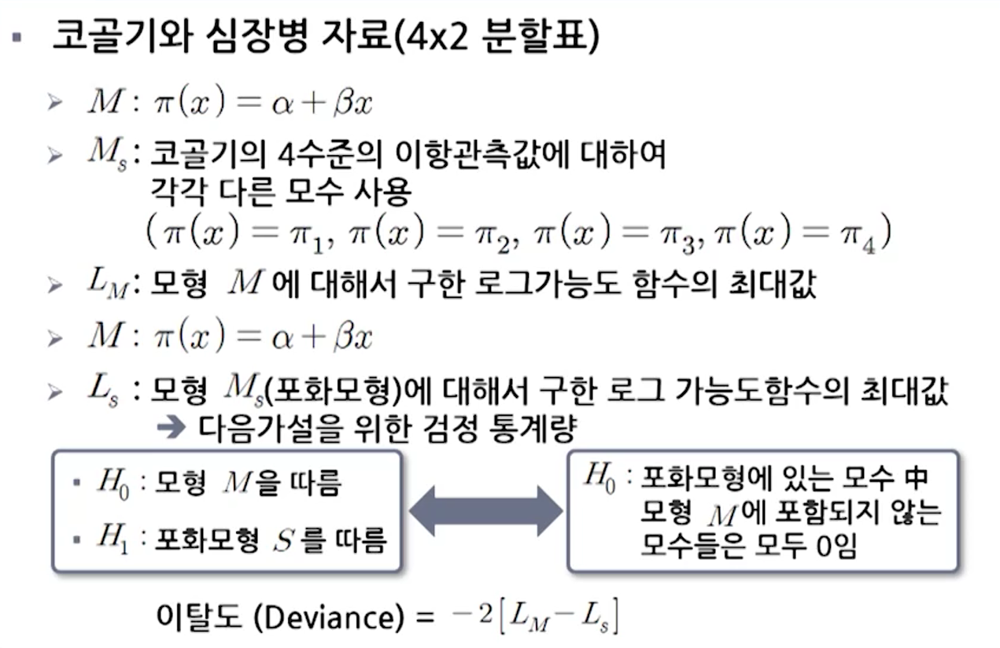

# 제5강 로지스틱 회귀모형

학습목표
1. GLM을 적용할 때 통계적 추론과 모형진단 방법을 설명할 수 있다.
2. 로지스틱회귀모형의 통계적 추론 방법을 설명할 수 있다.
3. 로지스틱회귀모형을 적용하여 분석하고 해석할 수 있다.

## 1. 통계적 추론과 모형진단(일반화 선형모형)

### 1. GLM 모수에 대한 추정

- 범주형 자료에 대해서 적용하는 대부분의 GLM에서 모수추정은 ML방법을 통해서 계산됨

- 모수 β에 대한 95% 신뢰구간(Wald 방법)

- 가설검정

- ① 왈드(Wald) 검정
  - 는 근사적으로 *N(0,1)*을 따름 또는 은 근사적으로 을 따름
  - SE는 에 대한 표준오차(β의 제약이 없는 상황에서 구함)

- ② 가능도비를 이용하는 방법
  - =귀무가설 하에서 가능도 함수의 최대값(β=0일 때)
  - =완전모형 하에서 가능도 함수의 최대값(β에 대한 제약 없음)
  - 가능도비(likelihood-ratio) 검정통계량
  
  (단, 와 은 각각 귀무가설과 완전모형 하에서의 로그 가능도함수의 최대값)

- ③ 스코어 검정
  - 귀무가설 β=0에서 가능도함수 L(β)에 접하는 선을 그를 때 그 선의 기울기를 사용함
  - 스코어 통계량은 이 기울기 값을 귀무가설의 β값을 이용하여 계산한 SE로 나눈 비로 정의함
  - 스코어 통계량의 제곱은 근사적으로 df=1인 카이제곱분포를 따름

- ④ 검정방법 비교

#### Note 1
- 왈드 방법 신뢰구간 작성
  - 귀무가설 에 대한 왈드 통계량: 
  - 95% 신뢰구간: 

#### Note 2
- 가능도비 방법에 의한 β에 대한 신뢰구간 작성(프로파일 가능도 신뢰구간)
  - 95% 신뢰구간 = "하의 가능도 검정에서 P-값이 0.05를 초과하는 모든 값들로 이루어짐"
  - 표본크기 n이 작거나 설명변수의 효과가 매우 큰 경우는 왈드 통계량보다 가능도비 통계량이 더 검정력이 높고 신뢰할 수 있음

### 2. 예제: 암컷 게와 부수체 연구

- 통계소프트웨어에 따라서는 가설 에 대한 유의성 검정방법으로 스코어 통계량(Score statistics)을 제공하기도 함
- 왈드 검정과 가능도비 검정은 표본크기가 큰 경우에는 유사한 성질을 가짐
- 표본의 크기가 대단히 크지 않은 경우는 가능도비 검정을 사용하는 것이 바람직한 것으로 알려짐

### 3. 이탈도(Deviance)

- 포화모형(Saturated Model)
  - 각 관측값에 대하여 각각 모수를 갖는 경우로 을 만족하는 모형을 말함
  - 포화모형은 가능한 모형 중 가장 복잡한(가장 모수가 많은) 형태의 모형으로 가능도함수(또느 로그가능도 함수)의 최대값을 가짐

- 이탈도 예제

- 이탈도는 df=(자료 수) - (모형 모수의 개수) 인 카이제곱 분포로 근사
- 검정통계량 값이 크고, P-값이 작을수록 모형 M의 적합결여에 대한 강한 증거가 됨

### 4. 관측치와 모형 적합값을 비교하는 잔차

- GLM에 대한 적합결여 통계량
  - 모형이 자료를 잘 적합하는지를 포괄적으로 요약하는 측도임
- 관측도수와 적합값을 비교해 보면 더 자세한 정보를 알 수 있음
  - 잔차 =  ⇒ 대개  가 커질수록 잔차도 커짐
  - 피어슨 잔차 = 
    - 예를 들어 포아송 GLM인 경우 
    - 참고: 피어슨 통계량
  
  - 표준화잔차=
    - 는 i번째 관측값의 leverage라고 함
    - 대체적으로 leverage가 크면 모형적합에 미치는 영향이 커짐
    - 표준화잔차가 2 또는 3정도로 크면 주의깊게 살펴봐야 함

## 2. 로지스틱회귀모형의 해석

### 1. 개요

- Y는 0 또는 1이 되는 경우: Y = 0 or 1
  π(x)는 Y=1이 될 확률: π(x) = P(Y=1)

- 일반화선형모형에서 Y가 이항분포이고, 연결함수가 canonical link인 경우
  

- 이항분포를 따르는 Y에 대해서 "logit" link를 사용하는 경우
  

### 2. 선형근사 해석

- β의 부호해석
  - ① β > 0 ⇔ π(x) ↑ as x ↑
  - ② β < 0 ⇔ π(x) ↓ as x ↑
  - ③ β = 0 ⇔  상수 as x ↑

- 로지스틱 회귀곡선에 대한 선형근사(β > 0 인 경우)

### 3. 참게 예제

- Y=1: 한 마리 이상의 부수체를 보유한 경우
  Y=0: 부수체가 없는 경우
- X: 암 참게의 등딱지 너비

- 로지스틱 회귀모형 적용(선형확률모형)
  - π(x): 너비가 x인 암 참게가 부수체를 가질 확률
  - 선형확률모형 π(x)=α+βx 을 적용하는 경우
  - 
  - x=33.5(최대 너비)에서 예측확률값: -1.766+0.092(33.5)=1.3
  ⇒ "예측 확률값이 1보다 크게 나타남"

- 로지스틱 회귀모형 적용(로짓링크 활용)
-  
  
  - 0"> 폭이 커질수록 예측확률 가 커짐
    - 

### 4. 오즈비 해석

- 
- 
- 즉, x+1에서의 오즈는 x에서의 오즈에 를 곱한 것과 같다.

- , x가 변하더라도 오즈는 변하지 않음

- 
  ⇒ 부수체에 대한 오즈는 너비가 1cm 증가함에 따라 배 증가함

### 5. 후향적 연구에서의 로지스틱 회귀모형

- 반응변수 Y가 랜덤이 아니고, 설명변수 X가 랜점인 경우에도 로지스틱 회귀모형을 적용할 수 있음
  ⇒ 주로 후향적 표본추출 설계에서 얻어짐
- 사례-대조 연구에서 Y=1("사례")과 Y=0("대조")인 개체로 구성된 표본으로부터 X값이 관측되는 예제에 적용 가능함
- 사례-대조 연구에서 로지스틱 회귀모형을 적용하여 관심있는 설명변수의 효과를 추정할 수 있음
- 모형에서 절편을 나타내는 α는 Y=1일 때와 Y=0일 때의 도수에 대한 상대적인 값이므로 의미를 갖지 못함

## 3. 로지스틱회귀모형에 대한 추론

### 1. 이항자료의 그룹화와 비그룹화

- 그룹화된 이항자료
  - 예: 코골기와 심장병 예제
  - 코골기와 심장병 예제에서 254명이 매일 코를 골며 그 중 30명이 심장병이 있음
  ⇒ 표본크기 254명 중 30명이 심장병이 있다고 표시 가능

- 비그룹화된 이항자료
  - 예: 암게의 부수체 자료
  - 설명변수가 연속형일 때의 이항자료
  - 그룹화 이항자료는 비그룹화 자료로 표시 가능

### 2. 효과에 대한 신뢰구간

- 에서 모수 β에 대한 신뢰구간  (왈드 방법)

- 에 대한 신뢰구간
  
  ⇒ 설명변수 x에서 한 단위 증가할 때 오즈에 미치는 효과에 대한 신뢰구간

- 참게 예제
  - 
  - 
  ⇒ β에 대한 95% 신뢰구간
  
  - 에 대한 95% 신뢰구간: 
  ⇒ 암 참게가 부수체를 소유할 오즈는 너비가 1cm 증가함에 따라서 적어도 36%에서 두 배까지 증가함

#### Note

- 표본크기 n이 작은 경우는 Wald 신뢰구간 보다는 가능도비(likelihood ratio) 신뢰구간을 사용하는 것이 바람직함
- SAS GENMOD 절차에서 LRCI 옵션을 이용하여 구할 수 있음

### 3. 유의성 검정

-  ⇔ "Y와 X는 서로 독립"
- 왈드 방법
  - 검정통계량 
  - 귀무가설 하에서 표준정규분포를 따름
- 가능도비 검정
  - 일 때 (π(x)가 모든 x값에 대해서 동일)의 로그가능도 함수의 최대값
  - β에 대한 아무런 제한 조건이 없는 경우에 로그가능도 함수의 최대값
  - 검정통계량: 
    - SAS GENMOD에서 TYPE3 옵션을 통해서 구할 수 있음

#### Note

- 로지스틱 회귀모형이 실제로 만족한다면 모형으로부터 구한 확률의 추정량 는 표본비율보다 더 좋은 추정량이 됨
- 모형을 이용한 추정방법은 주어진 x값에 해당하는 자료만을 이용하는 것이 아님
- 모든 자료를 사용하여 더 정확한 추정결과를 제공함