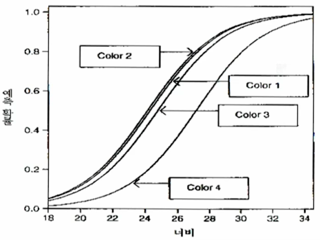
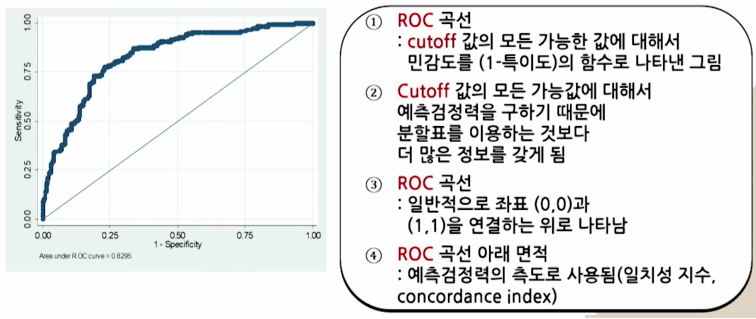

# 제6강 로지스틱 회귀모형(2)

학습목표
1. 범주형 설명변수를 갖는 로지스틱회귀모형을 적용할 수 있다.
2. 다중 로지스틱회귀모형을 적용할 때 효과에 대한 요약, 예측력 요약 등을 설명할 수 있다.
3. 다중 로지스틱회귀모형을 실제 데이터에 적용하고 그 결과를 해석할 수 있다.

## 01 범주형 예측변수들을 갖는 로지스틱회귀모형

### 1. 범주형 예측변수를 표현하는 지시변수

- 로지스틱회귀모형이란?
  - 로지스틱회귀모형은 회귀모형과 마찬가지로 여러 설명변수를 갖는 모형으로 확장 가능함
  - 예측변수 중 일부 또는 전부가 질적변수(범주형 변수)일 수 있음

- 두 개의 예측변수 X, Z와 반응변수 Y가 각각 (0,1)의 값을 갖는 이항변수인 경우
- X와 Z의 주효과를 갖는 로지스틱회귀모형
    
  x,z: 지시변수 또는 가변수(Dummy Variable)

- 모형 에서 가변수 값에 따른 로짓값

|x|z|로짓|
|:-:|:-:|:-:|
|0|0||
|1|0||
|0|1||
|1|1||

- Z가 주어졌을 때 x=1에서 "성공"일 오즈는 x=0에서 "성공"일 오즈의 배임
    
    

- 모형에서 교호작용이 없다는 것은 Z의 두 수준에서 구한 부분분할표에 대한 오즈비 값들이 동일하다는 것을 의미함 ⇔ 동질연관성 만족

### 2. 예제: 마리화나 사용에 대한 조사

- Note
  - 오하이오 데이톤 근처의 고등학교 고학년 학생 대상 조사
  - 그룹화 자료를 통해 마리화나 사용여부(1=예, 0=아니오)를 예측 목적
  - 성별과 인종의 주효과를 갖는 로지스틱회귀모형을 적합시킨 결과

|인종|성별|마리화나_예|마리화나_아니오|
|:-:|:-:|:-:|:-:|
|백인|여자|420|620|
|백인|남자|483|579|
|다른 인종|여자|25|55|
|다른 인종|남자|32|62|

X=성별, Z=인종, Y=마리화나 사용(1=예, 0=아니오)

- 적합결과
  
  - 마리화나 사용과 성별 사이의 조건부 오즈비는 exp(0.2026)=1.22 로 추정됨

- R 프로그램
```r
Marijuana <- read.table("http://www.stat.ufl.edu/~aa/cat/data/Marijuana.dat", header=TRUE)>
Marijuana
fit <- glm(yes/(yes+no)) ~ gender + race, weights = yes + no, family=binomial, data=Marijuana)
summary(fit)
```

### 3. 2×2×K 분할표에 대한 검정법
- Cochran-Mantel-Haenszel 검정법
  - Multi-center clinical trials 사례

|Center(Z)|처리(X)|반응(Y)_S|반응(Y)_F|
|:-:|:-:|:-:|:-:|
|1|1|||
|1|2|||
|2|1|||
|2|2|||
|:|:|:|:|
|K|1|||
|K|2|||


여기서 x는 X의 두 수준에 대한 가변수임

  - 모형에 대한 다른 형태의 표현
    - 
    - : 센터 K의 효과(보통 마지막 센터에 대한 상대적 크기로 표현)
    - x: X의 두 수준에 대한 가변수
    - exp(β): K개 분할표에서 Z를 통제했을 때의 X,Y의 공통 오즈비
    - Z를 통제했을 떄, X,Y간 조건부독립성 성립
    ⇔ β=0 (X,Y의 오즈비=1)

  -  에 대한 검정을 통해서 조건부 독립성 검정 가능
    - 가능도비 검정
    - Wald 검정
    - Cochran-Mantel-Haenszel 검정(CMH검정)

## 02 다중 로지스틱회귀모형

### 개요

- 다중 로지스틱회귀모형이란?
  - Y: 이항반응변수, π = P(Y=1)
  -  개의 설명변수가능도비 검정
  
  
    - : 다른 변수들을 통제할 경우, 가 미치는 효과
    - : 다른 설명변수가 고정되었을 때 가 한 단위 증가할 때 오즈의 증가 비

### 1. 참게 자료에 대한 로지스틱회귀모형 적합

- Y = 1, 한 마리 이상의 부수체를 보유한 경우
  Y = 0, 부수체가 없는 경우
- x: 너비
- 색깔에 대한 가변수: 밝은색, 약간 밝은색, 중간색, 약간 어두운색, 어두운색
  -  ⇒ 중간색, 그렇지 않은 경우 "0"
  -  ⇒ 약간 어두운색, 그렇지 않은 경우 "0"
  -  ⇒ 어두운색, 그렇지 않은 경우 "0"
  - 밝은색의 참게: 없음
  - 약간 밝은색인 경우는 -  인 경우임

```R
fit <- glm(y ~ width + factor(color), family=binomial, data=Crabs)
summary(fit)
```

-  일 때 결과값은
  - 
  - 어두운색 참게에 대한 예측결과()
  - 
  -  인 어두운색 참게가 부수체를 가질 확률
  

- 너비와 색깔을 예측변수로 갖는 로지스틱회귀모형 분석결과


- 참게의 너비가 주어진 경우 "중간색" 참게가 부수체를 가질 오즈는 "약간 밝은색" 참게에 비해서 1.075배 큼
  - 

- Note
  - 
  - 색깔과 너비 사이의 교호작용이 없는 것으로 간주하여 분석한 것임
  - 즉, 참게의 너비(x)가 π에 미치는 영향은 색깔과 무관하게 동일하다고 가정한 것임

### 2. 어떤 항이 필요한가를 보는 모형 비교

-  가설의 검정
(너비가 주어진 경우, Y는 색깔과 독립)
  - 가능도비 검정 통계량
  
  
  - 참게 색깔의 효과가 뚜렷하지는 않지만 완전히 무시할 수는 없음
  - 색깔에 대한 예측 변수를 모형에 포함하는 것이 바람직함

-  가설의 검정
  (색깔이 주어진 경우, Y는 너비와 독립)
  - 
  - 색깔이 주어진 경우, 너비가 x+1인 경우의 오즈는 너비가 x인 경우의 오즈에 비해서  배 큼

```R
summary(glm(y~width, family=binomial, data=Crabs))
library(car)
Anova(glm(y~width+factor(color), family=binomial, data=Crabs))
```

### 3. 순서형 예측변수를 양적변수로 분석

#### 1. 색깔의 범주점수로 c={1, 2, 3, 4} 를 사용하는 경우

- 색깔 범주에 단조성을 만족하는 단조점수를 부여하여 색깔에 대해서 선형효과를 갖도록 함
- <br>
  

```R
fit2 <- glm(y ~ width + color, family=binomial, data=Crabs)
summary(fit2)
anova(fit2, fit, test="LRT")
```

#### 2. 색깔 변수를 간단하게 정의하여 적용하는 경우

- 모형 적합 분석
  : 간단한 모형(가변수가 1개인 경우)
  : 복잡한 모형(가변수가 3개인 경우)
  - 가능도비 검정통계량 = 187.97-187.46 = 0.501(df=2)
  ⇒ "간단한 모형이 적합함"

```R
Crabs$c4 <- ifelse(Crabs$color == 4, 1, 0)
fit3 <- glm(y ~ width + c4, family=binomial, data=Crabs)
summary(fit3)
anova(fit3, fit, test="LRT")
```

### 4. 교호 작용을 포함한 모형


```R
glm(y ~ width + c4 + width:c4, family=binomial, data=Crabs)
```


- : 교호작용 없음() 검정
- 가능도비 검정통계량
  = 187.96 - 186.79 = 1.17 (df=1, P=0.28)
  - ⇒ 교호작용에 대한 Weak Evidence!
- 모형의 선택 과정에서 고려사항
  - 자료에 대한 적합성
  : 모형이 복잡해질수록 유리
  - 적합된 모형의 해석의 용이성
  : 모형이 간단할수록 유리

확증적(Confirmatory) 연구와 탐색적(Exploratory) 연구

## 03 로지스틱회귀모형의 효과에 대한 요약

### 1. 확률에 기초한 해석
- Note
  - 예측변수 의 효과 설명 방법
  다른 예측변수의 값을 표본평균으로 고정시킨 후 의
  가장 작은 값과 큰 값에서 을 구해 비교해보는 것
  

### 2. 주변 효과와 평균
- Note
  - 양적 예측변수의 상대적으로 작은 변화가 확률에 미치는 영향은 근사적으로 직선의 기울기를 사용하여 파악
  - 다른 설명변수를 고정했을 때 설명변수 가 한 단위 증가할 때마다 근사적으로 는 만큼 변화한다.

```R
fit3 <- glm(y ~ width + c4, family=binomial, data=Crabs)
library(mfx)
logitmfx(fit3, atmean=FALSE, data=Crabs)
```

### 3. 표준화된 해석

- Note
  - 예측변수가 여러 개인 경우, 예측 변수의 효과를 비교하기 위하여 의 크기를 비교할 수 있음
  - 이때 서로 다른 단위를 갖는 양적 예측변수 들의 효과를 비교하고자 할 때 표준화 계수(Standardized Coefficient)를 사용할 수 있음
  - 예측변수 대신에 로 대체하여 적합하게 구함

## 04 예측력 요약: 분류표, ROC 곡선

### 1. 예측력 요약: 분류표

- 분류표 이용
  - 이면 Y=1, 이면 Y=0 으로 예측

|실제|예측 |예측 |계|
|:-:|:-:|:-:|:-:|
|Y=1|94|17|111|
|Y=0|34|28|62|

- 민감도(Sensitivity): 
- 특이도(Specificity): 

### 2. 예측력 요약: ROC 곡선
- ROC 곡선 작성(Receiver Operating Characteristic Curve)
  - 분류표

|실제|예측 |예측 |계|
|:-:|:-:|:-:|:-:|
|Y=1|True Positives|False Negatives|P|
|Y=0|False Positives|True Negatives|N|

- P = True Positives + False Negatives
- TPR = TP / P, FPR = FP / N
- Sensitivity = TPR, Specificity = 1 - FPR



### 3. 예측력 요약: 다중상관성

- 다중상관성
  - 관찰된 반응변수 값 와 모형에서 구한 적합값 간에 구한 상관계수 R
  - 선형모형을 적합시키는 경우라면 최소제곱법에서 다중상관계수에 해당함

```R
fit <- glm(y ~ width + factor(color), family=binomial, data=Crabs)
cor(Crabs$y, fitted(fit))
```
