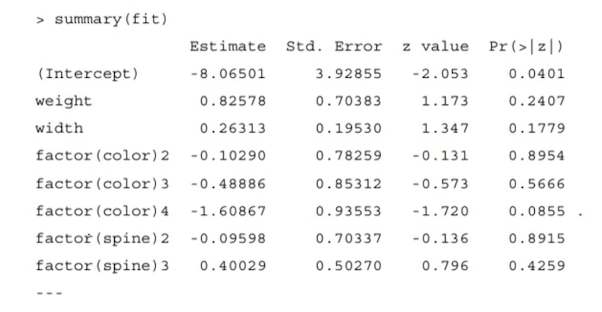
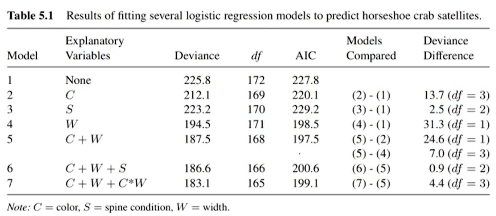
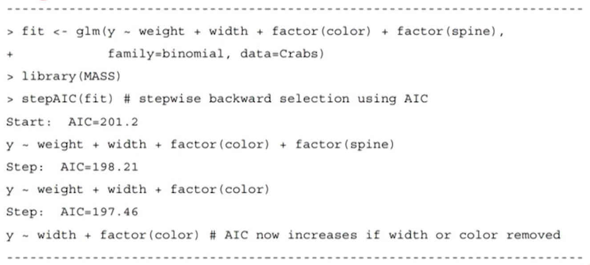
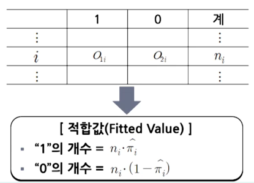
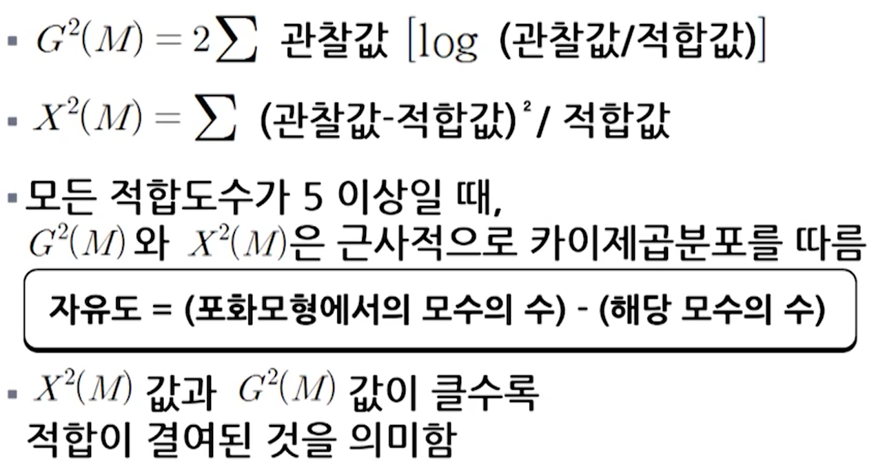
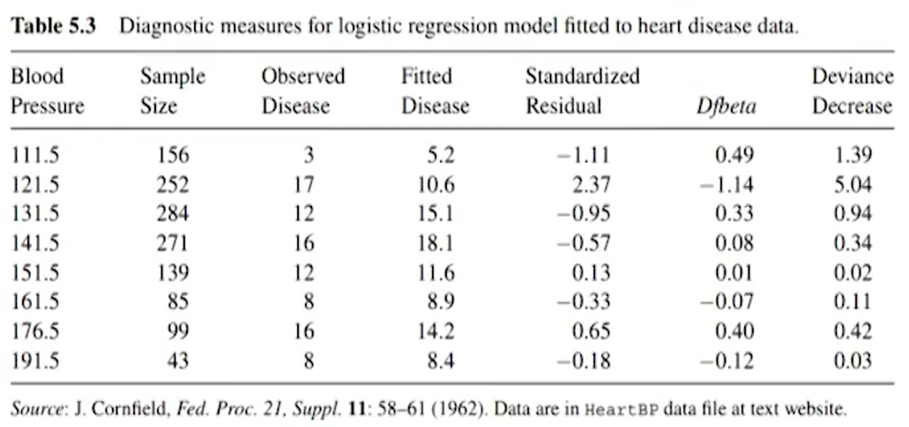
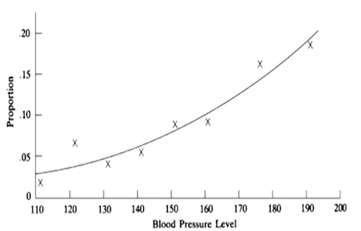
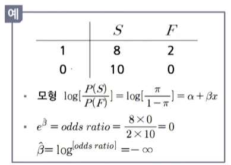
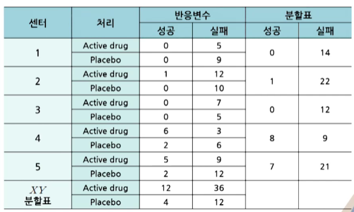

# 제7강 로지스틱 회귀모형(3)

학습목표
1. 로지스틱회귀모형 적합도 검증과 모형 선택을 설명할 수 있다.
2. 로지스틱회귀모형 진단과 잔차 분석을 설명할 수 있다.
3. 희박 자료의 의미와 추정에 미치는 영향을 설명할 수 있다.

## 01 모형선택의 전략

### 1. 모형 선택 고려사항

- 모형의 선택 과정에서 고려사항
  - 자료에 대한 적합성: 모형이 복잡해질수록 유리
  - 적합된 모형의 해석의 용이성: 모형이 간단할수록 유리
- 확증적(Confirmatory) 연구와 탐색적(Exploratory) 연구

### 2. 얼마나 많은 예측변수를 사용할 수 있는가?

- 가이드라인: P.Peduzzi 등
  - The data set should contain at least 10 outcomes of each type for every explanatory variable.
  - 예1
    - n=1000, Y=1 인 경우 30, Y=0 인 경우 970 이라면
    ⇒ 모형에 포함되는 예측변수는 3개 이하가 바람직함
  - 예2
    - n=173 참게, Y=1 인 경우 111, Y=0 인 경우 62 이라면
    ⇒ 모형에 포함되는 예측변수는 6개 이하가 바람직함
  - 이와 같은 가이드라인은 다소 보수적이어서 이 조건을 만족하지 않더라도 모형적합 결과를 얻을 수 있음
  - 이 가이드라인을 과도하게 위배하는 경우는 효과에 대한 ML 추정값은 매우 편향되고 표준오차의 추정값도 매우 클 수 있음
  - 여러 개의 예측변수를 갖는 모형은 다중공선성(multi-collinearity)의 문제가 발생할 수 있음

### 3. 예제: 암참게의 부수체 자료 재분석

- Y = 암 참게가 부수체를 갖고 있는지 여부
      (1=yes, 0=no)
- 예측변수
  - 무게(Weight)
  - 너비(Width)
  - 색깔(ML, M, MD, D), c2, c3, c4의 가변수로 나타냄
  - 등뼈 상태(3개 범주), s2, s3의 가변수로 나타냄
- 
-  에 대한 가능도비 검정 결과
  -  = 이탈도의 차이
    = 225.8 - 185.2 = 40.6
    df = 7, p-값 < 0.0001
  ⇒ 적어도 하나의 예측변수는 효과가 있다는 강한 증거

```r
Crabs <- read.table("http://www.stat.ufl.edu/~aa/cat/data/Crabs.dat", header=TRUE)
fit <- glm(y ~ weight + width + factor(color) + factor(spine), family=binomial, data=Crabs)
summary(fit)

1 - pchisq(225.76-185.20, 172-165)

library(car)
Anova(fit)
```



- 각 예측변수의 효과에 대한 Wald 검정 결과를 보면 거의 유의하지 않은 것으로 분석됨
  - 예측변수간의 강한 상관성으로 인한 다중공선성(Multicollinearity)으로 인해서 각 모수에 대한 유의성이 없는 것처럼 분석된 것으로 보임
  (Weight와 Width의 상관계수=0.89)
  ⇒ Weight와 Width를 모두 예측변수로 사용할 필요는 없고, 앞으로 Width만 예측변수로 사용함

### 4. 단계적 변수 선택법

- 전진선택법(Forward Selection Procedure)
  - 더 이상 적합이 개선되지 않을 때까지 항(예측변수)을 추가해 모형을 적합하는 방법
- 후진제거법(Backward Elimination Procedure)
  - 복잡한 모형에서 시작해서 항을 제거하면서 모형을 적합하는 방법
- ※ 범주형 예측변수에 대해서는 전체 지시변수(가변수)를 함께 모형에 포함하거나 빼야 함

### 5. 목적에 따른 설명변수의 선택

- 예측벼수를 선택할 때 연구 목표, 상대적 통계의 유의성, 다중공선성 및 잠재적 교란요인 등의 문제를 고려해서 변수 선택 전략을 정함
- Hosmer 등 (2013, 4장)에서 제안한 변수 선택 과정
  1. 초기 주효과 모형 적합: 잘 알려진 중요 변수, 단일 예측변수 모형에서 어느 정도 연관성(예: P값 < 0.2)이 있는 변수 이용
  2. 후진제거법 수행: 더 엄격한 유의수준에서 유의한 변수, 교락변수 남김
  3. 1단계 모형에 포함되지 않았지만, 2단계 이후 유의해진 변수 추가
  4. 3단계 모형의 변수들간의 교호작용 여부 확인
  5. 후속적인 모형 진단 작업 진행

### 6. 예제: 참게 자료에서의 변수 선택

- 참게 자료에 후진제거법의 적용
  - 예측변수로 W=Width, C=색깔, S=등뼈 상태 등을 고려함
  - 교호작용을 포함하는 복잡한 모형을 적합함
  - 가장 높은 차수의 항 중에서 "가장 덜 유의한"(P-값이 가장 큰) 예측 변수를 제외하고 다시 모형을 적합
  - 남은 예측변수가 모두 유의할 때까지 위의 과정을 계속함

- 참게 자료에 대한 여러 로지스틱회귀모형 적합 결과



- 최종 모형은 너비와 색깔의 주효과만을 갖는 모형
  - 모든 모형은 정확한 모형이라기 보다는 "실제 현상을 단순화시킨 것일 뿐임"

### 7. AIC와 편향/분산 간의 절충

- 모형선택: 편향과 분산 사이에 근본적인 절충 문제 발생
- Parsimony(Simplicity) is good
- 모형선택에서 기준(AIC, Akaike Information Criterion)을 이용할 수 있음: AIC 값이 최소인 모형을 선택함
- AIC = -2*(로그가능도)+2(모형에 있는 모수 개수)
  BIC = -2*(로그가능도)+log(n)*(모형에 있는 모수 개수)
  * BIC(Bayes Information Criterion), 표본크기가 큰 경우에 유용함(통계적 유의성, 실질적 유의성)
- 탐색적 연구라면 후진제거법과 같은 자동화 방법을 사용 가능
- 각 예측변수에 대하여 반응변수의 각 수준에서 적어도 10개의 관측치가 있는 것이 바람직함
- AIC를 이용하여 단계적으로 모형선택을 할 수 있음
  ⇒ AIC를 이용하여 후진제거법으로 모형을 선택하는 예



## 02 모형진단 방법

### 1. 적합도 검정: 이탈도 통계량 이용

- 이탈도 통계량을 이용한 모형비교?
  - 해당 모형과 더 복잡한 모형을 비교하는 가능도비 검정을 통해서 적합결여 여부를 검증하는 방법
  ⇒ 더 복잡한 모형을 적합하더라도 현재 고려하고 있는 모형과 비교하여 적합 정도가 개선되지 않는다면 이미 선택된 모형이 적합하다고 할 수 있음
- 예제: 참게자료 사례
  - , x 너비
  - 
  - 결과
    - 귀무가설  을 검정하는 가능도비
    - 검정통계량은 0.83이고, df=1
    - 따라서 p-값=0.36 ⇒ x제곱 항은 필요하지 않다.

- M: 현재 고려하고 있는 모형
- 포화모형: 각각의 관측치에 대해 개별적인 모수를 갖는 모형
- 모형 M의 적합도 검정(Goodness of fit test)
  - 포화모형에는 포함되어 있지만 모형 M에는 포함되지 않는 모든 모수가 "0"인지 검정하는 것
- GLM에서 적합도 검정을 위한 가능도비 통계량
  - ① 이탈도(Deviance) = 
  - ② 대표본의 경우 근사적으로 카이제곱분포를 따름
  - ③ 검정통계량 값이 크고, p-값이 작을수록 모형의 적합결여에 대한 강한 증거가 됨
- 예측변수가 모두 범주형 변수인 경우
  - 전체 Data는 예측변수들의 i번째 조합에 대해 분할표 도수로 요약됨




### 2. 예제: 마리화나 사용 조사
- 마리화나 사용자료

|인종(X)|성별(Z)|마리화나_예(1)|마리화나_아니오(0)|
|:-:|:-:|:-:|:-:|
|백인|여자|420|620|
|백인|남자|483|579|
|다른 인종|여자|25|55|
|다른 인종|남자|32|62|

- 로지스틱회귀모형 적합
  - 


```r
fit <- glm(yes/(yes+no) ~ gender + race, weights=yes+no, family=binomial, data=Marijuana)
fit$deviance; fit$df.residual

1 - pchisq(fit$deviancee, fit$df.residual)

fitted(fit)
fit.yes <- n*fitted(fit); fit.no <- n*(1-fitted(fit))
attach(Marijuana)
data.frame(race, gender, yes, fit.yes, no, fit.no)
```
### 3. 적합도 검정: 그룹, 비그룹, 연속형

- 그룹화·비그룹화 된 자료와 연속성 예측변수
  - 예측변수가 범주형인 경우 자료 파일의 구분
    - 그룹화된 자료: 각 예측변수의 조합에서 관측된 성공과 실패의 총합자료(분할표 형식으로 요약된 경우)
    - 비그룹화된 자료: 0과 1로 표현된 관측값으로 분할표 등으로 요약되기 전의 원자료
    - 모수의 ML 추정값: 위의 두 가지 형태의 자료에 대해서 동일함
    - 적합도 검정: 그룹화된 자료의 경우에만 적용할 수 있음
  - 과 는 적합도수가 5 이상인 분할표에 대해서 적용

  - 연속형 또는 연속형에 가까운 예측변수를 갖는 경우의 로지스틱회귀모형의 적합도 검정 방법
  - 검정방법
    - ① 각 예측변수를 범주화하여(예: 사분위수를 이용하여 4개의 범주로 구분) 그룹화된 자료의 관찰도수와 적합도수에 대해 과 를 적용함
    - ② 예측된 확률()을 크기 순에 따라 나열하고, 자료를 그룹화하여 관찰값과 적합값을 구하여 검정하는 방법: Hosmer-Lemeshow 검정
      - 설명변수의 모든 가능한 조합의 수 J가 전체 표본크기 n가 같거나 유사한 경우로 가정
      - 예측확률이 작은 값부터 큰 값 순서로 개체들을 배열한 후 백분위점을 기준으로 n/q개씩 개체들로 하나의 범주를 구성함(g×2 분할표로 변환됨)
      - Hosmer-Lemeshow 검정통계량: 
      -  는 자유도 g-2인 카이제곱분포로 근사됨
      -  값이 클수록 적합결여에 대한 강한 증거임
```SAS
PROC LOGISTIC;
  MODEL y=width/lackfit;
```

### 4. 로지스틱 모형의 잔차, 표준화 잔차, 이탈도 잔차
- 범주형 예측변수에 대해서, 
  관측도수와 적합도수를 비교하기 위하여 잔차를 사용함

- Pearson 잔차
  - Pearson 잔차 
    - SAS GENMOD에서 Reschi로 표현  
    - : "성공"한 도수
    - : 전체 시행횟수
    - : 적합된 모형으로부터 구한 의 예측값
    - 
- [참고] 회귀분석에서도 잔차를 비슷하게 사용
  - 포아송 GLM에서 
    - Pearson 잔차: 
    - 잔차의 제곱합 = 적합도 카이제곱 통계량
      ⇒ 이탈도 잔차의 제곱합으로 분해
- 표준화 잔차(Standardized Pearson Residual)
  - 표준화 잔차 
    - SAS GENMOD에서 StReschi로 표시
    - : 관측값의 레버지리(Leverage)를 나타내며 첫 행렬(Hat Matrix)의 대각원소임
    - 관측값의 레버리지가 클수록 모형적합에 미치는 잠재적인 영향력이 커짐
      - 근사적으로 
      - 2\;or\;3">이면 모형의 적합결여를 시사함

### 5. 로지스틱 모형에서 영향점 진단
- 로지스틱 회귀분석의 영향 측도들은 그룹화된 자료 파일의 관측값들에 대해서 유용하게 사용됨
- 영향력을 측정하기 위한 측도: 대게 전체 자료에서 한 관측값을 제거했을 때에 추정에 미치는 효과를 나타냄
  - 표준화잔차 및 이를 기반하는 측도들(예: Cook의 거리)
  - 모형의 각 모수에 대해서 한 관측값을 제거했을 떄, 모수의 추정값에 발생하는 변화량(예: Dfbeta(변화량을 표준오차로 나눈 값))
  - 관측값을 제거했을 때의 이탈도 감소량

### 6. 예제: 심장병과 혈압




## 03 로지스틱 회귀분석의 무한대 추정값

### 1. 완전과 준완전 분리: 완전한 분류

- 양적 예측변수에서 무한대 효과의 추정
  - y=0 for x<50 and y=1 for x>50
    (완전한 판별식의 경우)
  - 

    ⇒ 
  - GLM에서 모수 적합은 Fisher의 스코어 알고리즘을 사용하면 대개 잘 수렴함. 하지만 성공이 완전히 판별되는 경우, 성공이나 실패 중 하나만 관찰된 경우는 ML 추정값이 무한대 또는 존재하지 않을 수 있음

### 2. 희박한 자료(Sparse Data)
- 희박한 자료(Sparse Data)란?
  - 작은 도수를 갖는 칸들이 많은 분할표의 경우를 말함
  - 예측변수가 많거나 다수의 수준으로 분류된 분할표에서 흔히 발생함
  - 표집영(Sampling Zero)
    - 이론상으로 그 칸에 속한 관측값이 가능함
    - But 현재의 Data 상으로는 해당 칸의 도수가 0인 경우
    (표본의 크기가 충분히 커지면 양의 도수를 가질 수 있음)
    - 모형에 따라 표집영은 모형의 모수에 대한 ML추정값이 무한대가 되는 원인이 될 수 있음
    - 
- 예제: 희박한 자료를 가진 임상시험 자료


  - 성공이나 실패가 한 번도 없는 센터들은 모비율의 차이나 같은 모수를 추정하는 데는 유용함
  - 로지스틱회귀모형에서 오즈비를 추정하거나 처리효과가 있는지 여부를 알아보고자 할 때는 도움이 되지 않음

## 04 베이지안 추론, 벌점가능도 추정법

### 1. 베이지안 모형화: 사전분포 명시
- ML 추정값이 무한대일 때 편향성이 적고, 유한한 추정값을 구할 수 있는 수정된 가능도 기반의 방법 중 하나
- 로지스틱 회귀분석에서 베이지안 추론은 보통 를 평균이 0이고, 서로 독립인 정규분포의 확률변수로 취급하여 추론함
- 보통 정규분포의 표준편차 값을 아주 크게하여 사전분포가 결과적으로 추정 결과에 거의 영향을 미치지 않도록

### 2. 로지스틱모형에서 벌점가능도(Penalized Likelihood)
- 매우 희박한 분할표와 같이 잠재적으로 추정이 불안정한 상황에서 ML방법을 수정하여 합리적인 추정을 하는 방법
- 모형의 모수 β에 대한 로그 가능도 함수 L(β)가 있는 모형에 대해서 다음 식을 최대로 하는 추정값을 찾는 방법
  L*(β) = L(β) - s(β)
  여기서 s()는 β가 더 평활해(smoother)질수록 s(β)가 감소하는 함수
- 이 평활화 방법은 ML추정값을 0으로 축소시킴
  ML추정값이 무한대 값을 갖거나 다중공선성이 있는 경우 좀 더 안정적인 추정결과를 제공함


