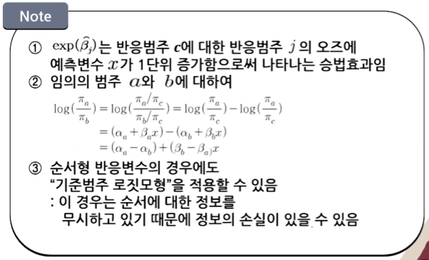
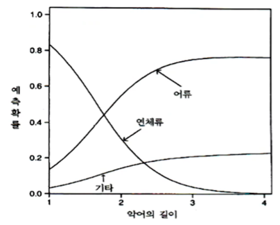
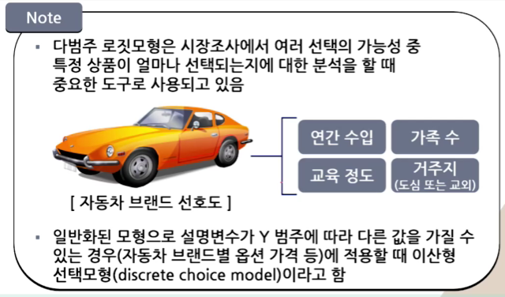
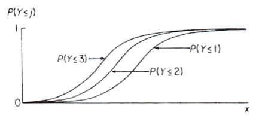

# 제9강 로지스틱 회귀모형(4)

학습목표
1. 명목형 반응변수에 대한 기준범주 로짓모형을 설명할 수 있다.
2. 순서형 반응변수에 대한 누적 로짓모형을 설명할 수 있다.
3. 대응쌍 자료에 대해서 주변동질성을 검정할 수 있다.

## 01 명목형 반응변수들에 대한 기준범주 로짓 모형

### 명목형 반응의 로짓모형

- 다범주 로짓모형
  - 명목형 반응변수 Y가 범주 1,2,3,...,c 를 갖는 경우(c>2)
  - 각 범주에 대응하는 반응확률: 
  - n명의 관측치를 c개 범주에 할당시키는 표본모형
  → 다항분포(Multinomial Distribution)를 따름

### 1. 기준범주를 이용한 로짓 모형

- 기준범주 로짓
  - 
  - 임의로 하나의 기준범주(Baseline-category)를 선택한 후 이 범주와 나머지 각 반응범주와 짝을 지어 로짓을 정의함
  - 기준범주 로짓(마지막 범주 c가 기준일 때)
    - 
    - 예측변수 x를 가진 기준범주 로짓모형
    
    "각 로짓에 대해서 서로 다른 모수  가정"



### 2. 예제: 악어의 먹이 선택

- 미국 플로리다 주의 59마리 악어의 길이(미터)와 주요 먹이
  - 독립변수(X): 길이
  - 반응변수(Y): 주요 먹이 - F=어류(Fish), I=연체류(Invertebrates), O=기타(Others)

```r
Gators = read.table("http://www.stat.ufl.edu/~aa/cat/data/Alligators.dat")

library(VGAM)
fit = vglm(y~x, family=multinomial, data=Gators)
coef(fit, matrix=TRUE)
summary(fit)
```

- 기준범주 로짓모형에 대한 추정 결과

|모수|어류/기타|연체류/기타|
|:-:|:-:|:-:|
|절편|1.618|5.697|
|길이|-0.110|-2.465|

- Y="주요 먹이", x="악어의 길이", c=3 인경우
  - $log(\hat{\pi_1}/\hat{\pi_3})=1.618-0.110x$
  - $log(\hat{\pi_2}/\hat{\pi_3})=5.697-2.465x$
  - $log(\hat{\pi_1}/\hat{\pi_2})=(1.618-5.697)+[-1.110-(-2.465)]x\\ \hspace{5em}=-4.08+2.355x$
  - 큰 악어일수록 "연체류(2)" 보다 "어류(1)"를 선호하는 경향이 있음
  - 길이가 x미터인 악어세 비해 길이가 x+1 미터인 악어의 주요 먹이는 "연체류"가 아님
  - "어류"일 오즈의 추정값은 $exp(2.355)=10.5$배 임

```r
fit2 = vglm(y~x, family=multinomial(refLevel="I"), data=Gators)
summary(fit2)
confint(fit2, method="profile")
```

|모수|어류/연체류|기타/연체류|
|:-:|:-:|:-:|
|절편|-4.080|-5.697|
|길이|2.355|2.465|

### 3. 반응확률의 추정

- $log\left(\displaystyle\frac{\pi_j}{\pi_c}\right)=\alpha_j+\beta_jx,\;\;\; j=1,2,\cdots,c-1$
  - $\displaystyle\frac{\pi_j}{\pi_c}=e^{\alpha_j+\beta_jx},\;\;\;(\displaystyle\sum_{j=1}^{c}\pi_j=1)$
  - $\displaystyle{\pi_j=\frac{e^{\alpha_j+\beta_j x}}{1+e^{\alpha_1+\beta_1 x}+\cdots+e^{\alpha_{c-1}+\beta_{c-1} x}},\;\;\; j=1,2,\cdots,c-1}$
  - $\displaystyle{\pi_c=\frac{1}{1+e^{\alpha_1+\beta_1 x}+\cdots+e^{\alpha_{c-1}+\beta_{c-1} x}}}$
  - 그래서 결과는 다음과 같다.
    - $\pi_1=\dfrac{e^{1.62-0.11x}}{1+e^{1.62-0.11x}+e^{5.70-2.47x}}$
    <br>
    - $\pi_2=\dfrac{e^{5.70-2.47x}}{1+e^{1.62-0.11x}+e^{5.70-2.47x}}$
    <br>
    - $\pi_3=\dfrac{1}{1+e^{1.62-0.11x}+e^{5.70-2.47x}}$

- 악어의 주요 먹이 선택에 대한 예측확률


### 4. 예제: 사후 세계에 관한 연구

- 사후 세계에 관한 연구

|인종|성별|믿는다|잘 모르겠다|믿지 않는다|
|:-:|:-:|:-:|:-:|:-:|
|백인|여성|371|49|74|
|백인|남성|250|45|71|
|흑인|여성|64|9|15|
|흑인|남성|25|5|13|

- $log(\dfrac{\pi_j}{\pi_3})=\alpha_j+\beta_j^G x_1+\beta_j^R x_2,\;\;\; j=1,2$ 

- "아니오" 범주를 기준으로 설정한 경우 "사후세계에 대한 믿음에 대해 성별과 인종 간에 교호작용 효과는 없다"고 가정함

```r
Afterlife = read.table("http://www.stat.ufl.edu/~aa/cat/data/Afterlife.dat", header=TRUE)

library(VGAM)
# 성별과 인종을 모두 포함
fit = vglm(cbind(yes, undecided, no) ~ gender + race, family=multinomial, data=Afterlife)
summary(fit)

## 인종만 모두 포함
fit.race = vglm(cbind(yes, undecided, no) ~ race, family=multinomial, data=Afterlife)
deviance(fit.race)
lrtest(fit, fit.race)
```
- $H_0: \beta_1^G = \beta_2^G = 0$   :"사후세계 믿음에 대해 성별 주효과는 없다"는 가설에 대한 검정

### 5. 이산형 선택모형



## 02 순서형 반응변수들에 대한 누적 로짓 모형

- 순서형 반응변수에 대한 로짓 모형
  - 반응범주들이 순서형인 경우는 순서를 고려한 로짓을 정의할 수 있음
  → 순서를 고려한 로짓 모형은 해석이 간단하고 보통의 다범주 로짓 모형보다 더 좋은 검정력을 갖게 됨
  - 누적확률(cumulative probability)
  $P(Y\leq j)=\pi_1+\cdots+\pi_j,\;\;\; j=1,2,\cdots,c $
  - 누적로짓(cumulative logit)
  $logit[P(Y\leq j)]=log\left[\dfrac{P(Y\leq j)}{1-P(Y\leq j)}\right]=log\left[\dfrac{\pi_1+\cdots+\pi_j}{\pi_{j+1}+\cdots+\pi_j}\right] \\ \hspace{7em}j=1,2,\cdots,c-1$

  - c=3인 경우의 누적 로짓
  $logit[P(Y\leq 1)]=log(\dfrac{\pi_1}{\pi_2+\pi_3})$
  $logit[P(Y\leq 2)]=log(\dfrac{\pi_1+\pi_2}{\pi_3})$

### 1. 비례오즈 누적 로짓 모형

- 예측변수 X에 대하여
  $logit[P(Y\leq j)]=\alpha_j+\beta x,\;\;\; j=1,2,\cdots,c-1$
- ⇒"1,2,...,j 의 범주들을 하나의 범주로 합하고, j+1 부터 c까지의 범주를 다른 하나의 범주로 보는 로지스틱 회귀모형과 비슷함"
- 각각의 누적 로짓에 대해서 서로 다른 절편 $\alpha_j$와 같은 기울기 $\beta$를 가정함
- 4개의 반응범주와 하나의 연속형 예측변수 x에 대한 비례오즈 모형



- "각각의 j에 대해 $\beta$의 효과가 같다는 것은 세 개의 곡선이 같은 모양을 갖는다는 의미임"

- X가 a와 b일 떄 오즈비
  $\dfrac{P(Y\leq j|x=a)/P(Y>j|X=a)}{P(Y\leq j|x=b)/P(Y>j|X=b)}$
- 여기에 로그를 취하면
  $log\left(\dfrac{P(Y\leq j|X=a)}{P(Y>j|X=a)} \right)-log\left(\dfrac{P(Y\leq j|X=b)}{P(Y>j|X=b)} \right)$
  $=logit[P(Y\leq j|X=a)]-logit[P(Y\leq j|X=b)]$
  $=\beta(a-b),\;\;\; j=1,2,\cdots,c-1$

- $\dfrac{odds\;of\;(Y\leq j)\;at\; a}{odds\;of\;(Y\leq j)\;at\;b}=e^{\beta(a-b)}$
→ 어떤 주어진 범주 이하의 반응에 대한 오즈는 x가 한 단위 증가하면 $e^{\beta}$ 배만큼 증가함
→ 비례오즈 모형(proportional odds model)
- $\beta=0$ 만족 ⇔ X와 Y는 통계적으로 독립

### 2. 예제: 정치성향과 가입정당의 관련성

- 개인의 정치성향과 가입정당의 관련성 자료

|성별|정당|매우 진보적|약간 진보적|중간|약간 보수적|매우 보수적|
|:-:|:-:|:-:|:-:|:-:|:-:|:-:|
|여성|민주당|25|105|86|28|4|
|여성|공화당|0|5|15|83|32|
|남성|민주당|20|73|43|20|3|
|남성|공화당|0|1|14|72|32|

- 정치성향 5점 척도
  - 1:매우 진보적, 2:약간 진보적, 3:중간, 4:약간 보수적, 5:매우 보수적
- 가입정당
  - 1:공화당, 0:민주당
- 성별
  - 1:남성, 0:여성

```r
Polviews = read.table("http://www.stat.ufl.edu/~aa/cat/data/Polviews.dat", header=TRUE)

library(VGAM)
fit = vglm(cbind(y1,y2,y3,y4,y5) ~ party + gender, family=cumulative(parallel=TRUE), data=Polviews)
summary(fit)
```

- $logit[P(Y\leq j)]=\alpha_j+\beta_1 x_1+\beta_2 x_2$
  - 비례오즈 누적로짓 모형에서 절편은 관심모수가 아님

- 분석결과 해석
  - ① 비례오즈 로짓 모형에서 $\beta_1$에 대한 ML 추정
    - $\hat{\beta_1}=-3.634\;\;(SE=0.218)$
  → 고정된 j에 대하여 진보적 방향으로 응답할 오즈는 민주당원에 비해 공화당원일 때 $exp(-3.634)=0.0026$ 배임
  → 개인의 가입정당과 정치성향은 강한 관련성이 있으며 민주당원이 공화당원에 비해 더 진보적인 성향을 띠고 있다.

```r
attach(Polviews)
data.frame(gender, party, fitted(fit)) # y1=very lib, y5=very conserv
```

- 모형의 모수에 대한 추론

```r
# removing party effect
fit2 = vglm(cbind(y1,y2,y3,y4,y5)~gender, family=cumulative(parallel=TRUE), data=Polviews)

lrtest(fit, fit2)
confint(fit, method="profile")
```
  - 가입정당과 정치성향은 강한 연관성이 존재한다는 강한 근거

### 3. 순서형 분석의 검정력 증가

- 순서형 변수들에 대한 분할표에서 독립성 검정을 할 때 순서형 검정이 모든 변수들을 명목형 변수로 처리하는 카이제곱검정에 비해 더 적절하고 큰 검정력을 가짐
- Y의 순서정보를 이용하는 누적 로짓모형이 Y를 명목형 변수로 간주하여 분석하는 기준범주 로짓모형보다 더 큰 검정력을 가집
- 적합도가 다소 떨어지더라도 좀 더 간단한 모형이 효과의 대부분을 설명할 수 있다면 간단한 모형을 사용하는 것이 바람직함

### 4. 예제: 총 가구 수입과 행복도

- 흑인에 대한 행복도와 총 가구 수입 자료(괄호 안 도수는 백인에 대한 자료)

|총 가구 수입|행복하지 않음|좀 행복함|아주 행복함|
|:-:|:-:|:-:|:-:|
|평균 이하|37(128)|90(324)|45(107)|
|평균|25(66)|93(479)|56(295)|
|평균 이상|6(35)|18(247)|13(184)|

- Y=행복도
  - 1=행복하지 않음, 2=좀 행복함, 3=아주 행복함
- x=총 가구수입(양적 변수로 처리)
  - 1=평균 이하, 2=평균, 3=평균 이상
- 비례오즈 모형
  - $logit[P(Y\leq j)]=\alpha_j+\beta x,\;\;\; j=1,2$
  - $\hat\beta=-0.267$ 이므로 총 수입이 증가할수록 "행복하지 않음" 범주가 나올 경향은 점점 감소하는 것을 알 수 있음

```R
Happy = read.table("http://www.stat.ufl.edu/~aa/cat/data/Happy.dat", header=TRUE)

library(VGAM)
fit = vglm(cbind(y1,y2,y3) ~ income, family=cumulative(parallel=TRUE), data=Happy)
fit0 = vglm(cbind(y1,y2,y3) ~ 1, family~cumulative(parallel=TRUE), data=Happy) # null model

lrtest(fit, fit0)
```

- 총 가구수입을 명목형으로 처리하는 모델

```R
fit2 = vglm(cbind(y1,y2,y3)~factor(income), family=multinomial, data=Happy)
fit0 = vglm(cbind(y1,y2,y3)~1, family=multinomial, data=Happy)

lrtes(fit2, fit0)
```
  - $log\left(\dfrac{\pi_j}{\pi_3}\right)=\alpha_j +\beta_{j1}x_1+\beta_{j2}x_2,\;\;\;j=1,2$
  - $H_0: \beta_{j1}=\beta_{j2}=0,\;\;\;j=1,2$
  - 가구수입에 대한 선형효과와 같은 가정을 하지 않은 모형임
  - 귀무가설 하에서 더 많은 모수를 사용하기 때문에 검정력이 높지 않음

### 5. 잠재변수 선형모형과 누적연결함수 관계

- 누적 로짓 모형에서 비례 오즈 형태를 가정하면 하나의 예측변수 효과는 c-1 개의 누적 로짓 모형 식에서 모두 동일하게 됨
- 비례 오즈 구조는 단순 잠재변수모형에 의해서 자동적으로 만들어짐
- $Y^*$를 연속형 잠재변수라고 하고, $Y^*$의 절단점을 $-\infty=\alpha_0<\alpha_1<\cdots<\alpha_c=\infty$ 라고 함
$$Y=j\;\;if\;\;\alpha_{j-1}<Y^*\leq \alpha_j $$
- 잠재변수 $Y^*$의 평균이 설명변수와 관련된 회귀모형을 만족
$$Y^*=\alpha+\beta_1 x_1+\cdots+\beta_p x_p+\epsilon$$
- $Y^*$를 연속형 잠재변수라고 할 때
$$Y=j\;\;if\;\;\alpha_{j-1}<Y^*\leq \alpha_j$$
- $P(Y\leq j)=P(Y^*\leq\alpha_j)=P(\epsilon\leq\alpha_j-\alpha-\beta_1 x_1-\cdots-\beta_p x_p)$
- $link[P(Y\leq j)]=\alpha_j-\beta_1 x_1-\cdots-\beta_p x_p$
  - 오차항 $\epsilon$이 정규분포이면 이에 대응되는 연결함수는 프로빗(probit) 함수
  - 오차항 $\epsilon$이 로지스틱 분포(정규분포처럼 종모양, 대칭이나 꼬리부분이 더 두터움)를 따르면 이에 대응되는 연결함수는 로짓(logit) 함수가 되고 잠재변수 모형은 누적 로짓 모형이 됨

### 6. 반응범주 선택에 대한 불변성

- 잠재변수 선형모형과 누적 로짓 모형에서 비례 오즈 형태를 가정한다면 Y의 범주를 어떻게 선택하든지 상관없이 효과에 대한 모수는 변하지 않음
- 정치성향을 측정한 연속형 변수에 대해서 이산형 변수로 바꿀 때 (진보적, 중간, 보수적) 범주로 나누든지 또는 (매우 개방적, 약간 개방적, 약간 보수적, 매우 보수적) 범주로 나누든지 상관없이 모수의 효과는 동일하게 됨

## 03 대응쌍 자료의 주변동질성

- 대응쌍 자료의 주변동질성
  - 동일한 대상에 대해서 두 번의 조사를 한 경우나 한 표본의 개체와 다른 표본의 개체간에 자연스러운 짝 관계(pairing, 쌍)가 있는 경우에 만들어진 대응쌍 자료의 분석방법
  - 대응쌍이 흔히 발생하는 경우는 각 개체에 대해서 반복적으로 관측하는 경우로, 예를 들어 경시적(longitudinal) 연구에서 동일한 대상을 시간의 흐름에 따라 반복적으로 관측하는 경우임
  - 주변동질성 검정의 문제를 다룸

### 1. 사례 ①: 환경개선과 관련한 일반사회조사 사례
- 1144명을 대상으로 환경개선을 위해서 (1)더 높은 세금을 지불할 의향이 있는지 (2)생활수준 긴축을 받아들일 의향이 있는지 응답하도록 함
- 조사 결과

|더 많은 세금 지불|생활수준의 긴축_찬성|생활수준의 긴축_반대|합계|
|:-:|:-:|:-:|:-:|
|찬성|227|132|359|
|반대|107|678|785|
|합계|334|810|1144|

- 특성상 두 설문항목에 대한 응답결과는 서로 종속되어 있음(표본 오즈비=10.9)
- 더 많은 세금 지불에 "찬성"한 비율 = 359 / 1144 = 0.314
- 생활수준의 긴축에 "찬성"한 비율 = 334 / 1144 = 0.292

- 주요 관심사
  $\pi_{1+}=\pi_{+1}$ ⇔ 주변동질성(marginal homogeneity)
  $[\pi_{1+}-\pi_{+1}=(\pi_{11}+\pi_{12})-(\pi_{11}+\pi_{21})=\pi_{12}-\pi_{21}]$
  $\pi_{1+}=\pi_{+1} \Leftrightarrow \pi_{12}=\pi_{21}$
→ 주변동질성 $\pi_{1+}=\pi_{+1}$ 을 검정하는 문제는 $\pi_{12}=\pi_{21}$을 검정하는 문제로 바꿔서 풀 수 있다.

### 사례②: 신약효과 실험
- 86명의 실험 대상자에 대해서 각각 랜덤하게 (신약→가짜약) 또는 (가짜약→신약) 순으로 복용하게 한 후 그 효과를 조사함
- 실험결과

|구분|가짜약_S|가짜약_F|계|
|:-:|:-:|:-:|:-:|
|신약_S|12|49|61|
|신약_F|10|15|25|
|계|22|64|86|

- 확률분포

||S|F||
|:-:|:-:|:-:|:-:|
|S|$\pi_{11}$|$\pi_{21}$|$\pi_{+1}$|
|F|$\pi_{12}$|$\pi_{22}$|$\pi_{+2}$|
||$\pi_{1+}$|$\pi_{2+}$|1.0|

- 주요 관심사
  - $\pi_{1+}-\pi_{+1}$ 에 대한 추론 ⇔ 주변동질성 만족 여부

### 3. 맥니마 검정(McNemar Test)
- $H_0$: 주변동질성 만족 $(\pi_{1+}=\pi_{+1}\Leftrightarrow\pi_{12}=\pi_{21})$
$\Leftrightarrow \dfrac{\pi_{12}}{\pi_{12}+\pi_{21}}=\dfrac{1}{2}$

⇒ "대응쌍 자료에서 귀무가설을 만족하는 경우는 $n_{12}$와 $n_{21}$은 같은 기대도수를 갖게 됨"

- $n^*=n_{12}+n_{21}$ 으로 정의하면 귀무가설이 성립할 때
  $n_{12}\sim B(n^*, \frac{1}{2}),$
  $E(n_{12})=n^*/2,$
  $\sqrt{Var(n_{12})}=\sqrt{n^*(\frac{1}{2})(\frac{1}{2})}$
- 검정통계량
  $Z=\dfrac{n_{12}-n^*/2}{\sqrt{n^*(\frac{1}{2})(\frac{1}{2})}}=\dfrac{n_{12}-n_{21}}{\sqrt{n_{12}+n_{21}}}\sim N(0,1)$
  또는
  $Z^2=\dfrac{(n_{12}-n_{21})^2}{n_{12}+n_{21}}\sim \chi_1^2$

- 맥니마 검정 결과
  - ① 환경개선 관련 일반 사회조사
  $Z=\dfrac{132-107}{\sqrt{132+107}}=1.617$
  →$Z^2=2.6151, df=1, p값=0.1059$
  - ② 신약효과 사례
  $Z=\dfrac{49-10}{\sqrt{49+10}}=5.1$
  →$p값<0.0001$

- $\pi_{1+}-\pi_{+1}$에 대한 신뢰구간 작성
  - $\pi_{1+}-\pi_{+1}$의 추정량: $p_{1+}-p_{+1}$
  - SE = $\sqrt{\hat{Var}(p_{1+}-p_{+1})} \\ \hspace{1em}=\dfrac{1}{n}\sqrt{(n_{12}+n_{21})-\dfrac{(n_{12}-n_{21})^2}{n}}$
- 95% 신뢰구간: $(p_{1+}-p_{+1})\pm 1.96\times SE$