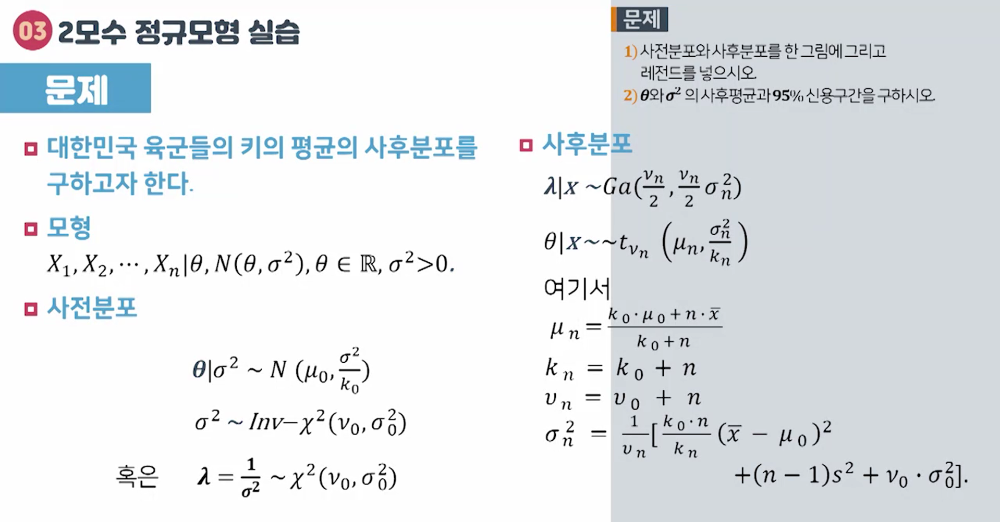

# 05강 이모수 정규모형

## 01 정규모형과 켤레사전분포

- 모형
0">
  - 0"> 는 둘 다 모르는 값이다.

- 사전분포
  -  
    - 는 사전분포 정보의 양 또는 사전표본의 크기
    - 인 경우 사전분포가 가진 정보의 크기가 관측치 1개와 같다.
  -  
    - 혹은 ,
    - 여기서, 0">

  - 사전분포를 θ와 의 분포로 지정해야 한다: 
    - 분포를 지정하는 형태를 어떻게 했냐하면,
    - 이 주어진 상태에서의 θ의 조건부 분포 와
    - 의 분포인 의 곱으로 지정했다.
    - 식으로 나타내면
      - 
    - 약간 편하게 표현하려면 이라고 하고,
      -  이렇게 표현할 수도 있다.
- 사전분포를 지정했으면 사후분포는 다음과 같이 지정하면 된다.
    - 

- θ에 대한 조건부 사후분포: 
  - 

- λ에 대한 조건부 사후분포: 
  - 

- λ에 대한 주변 사후분포: 
  - 

- θ에 대한 주변 사후분포: 
  - 

- [참고] 사후분포의 파라미터
  - 
  - 
  - 
  - 

### 사후분포 유도과정

- 각각 다음과 같이 모형, 사전분포가 정해졌을 때 사후분포를 유도해본다.
  - 모형: 
  - 사전분포
    - 
    - 
  - 사후분포
    - 
    
    
     
    
    
    - θ의 조건부 분포: 
    
    
    - λ가 주어졌을 때 θ의 분포: 
    - λ의 분포: 
    

### 베이즈 추정량과 신용집합

- 베이즈 추정량들
  - 
  - 
  - 

- θ에 대한 100(1-α)% 신용집합
  - 

- λ에 대한 100(1-α)% 신용집합
  - 

## 02 정규모형과 무정보사전분포

- 모형은 켤레사전분포와 동일
  - 모형: 

- 무정보사전분포: 정보를 하나도 가지고 있지 않은 사전분포
  - 
  - 

- 사후분포
  - 
  

  - 총 조건부 사후분포(full conditional posteriors)
    - 
    - 
  - 주변 사후분포
    - 
    - θ에 대한 100(1-α)% 신용구간
      - 
      ⇒ 이것은 빈도론자들의 θ에 대한 100(1-α)% 신뢰구간과 일치

## 03 2모수 정규모형 실습

자세한 내용은 05강 이모수 정규모형.ipynb 참조