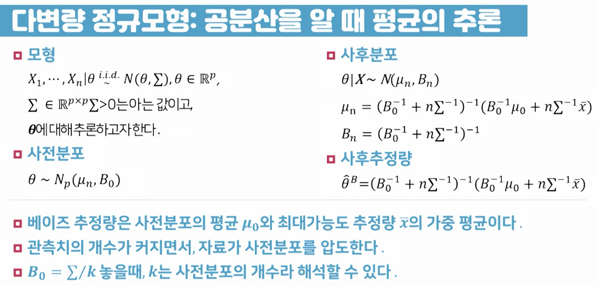
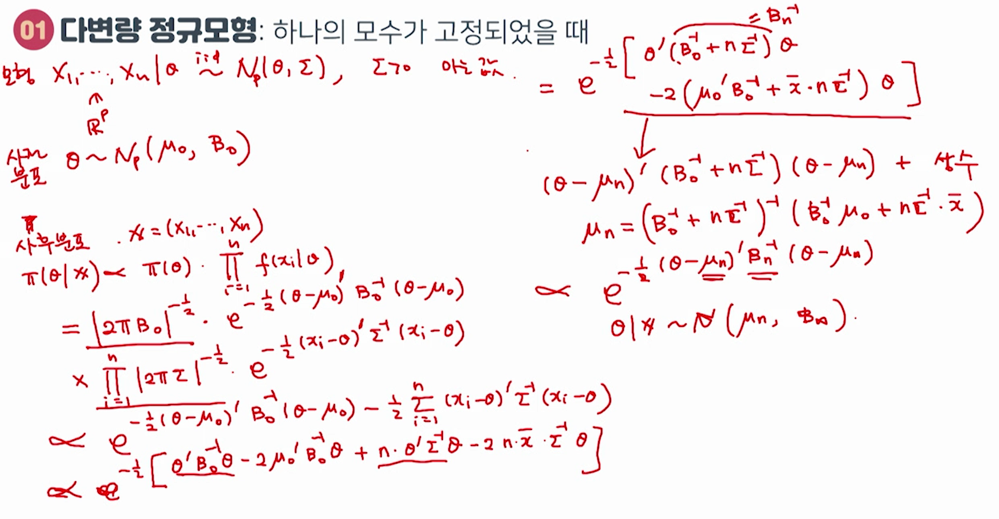
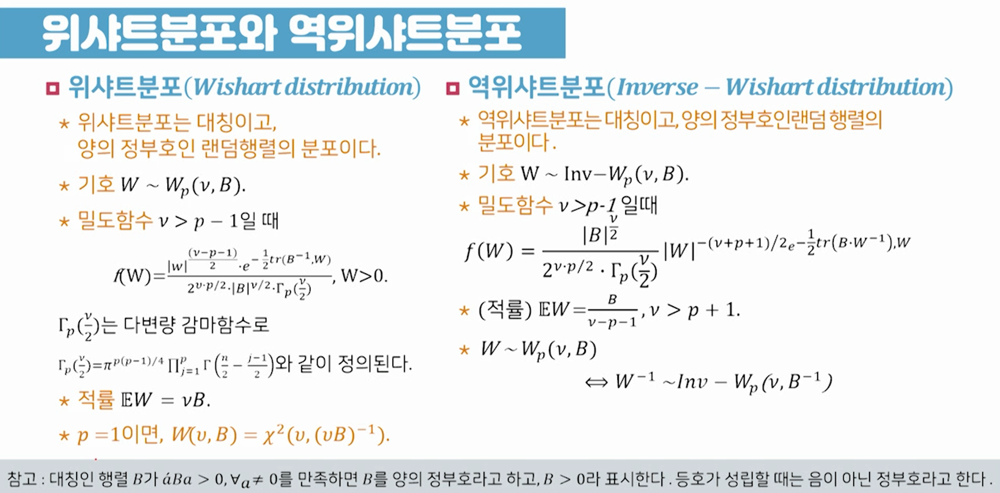
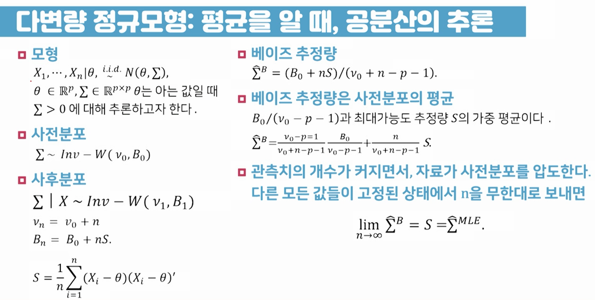
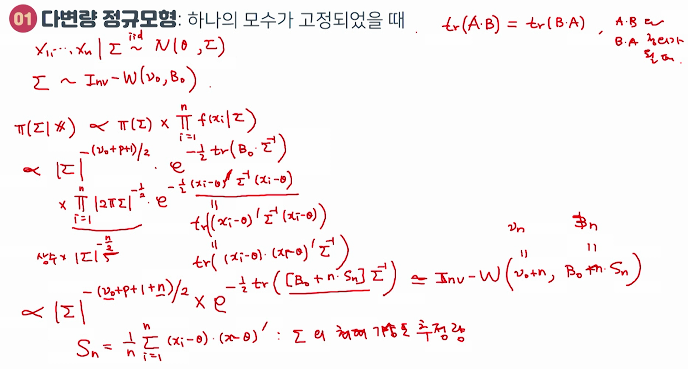
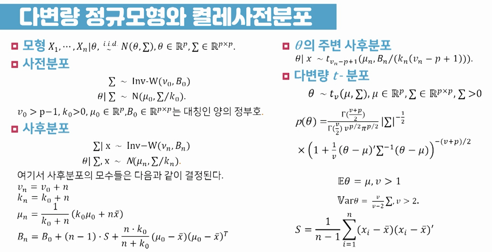
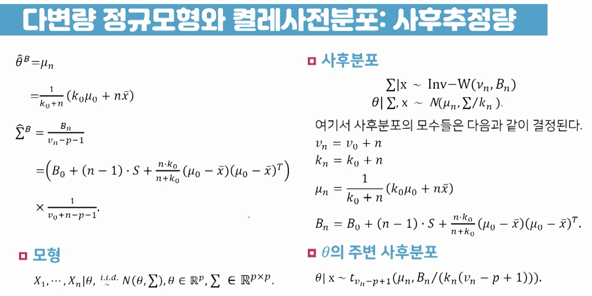
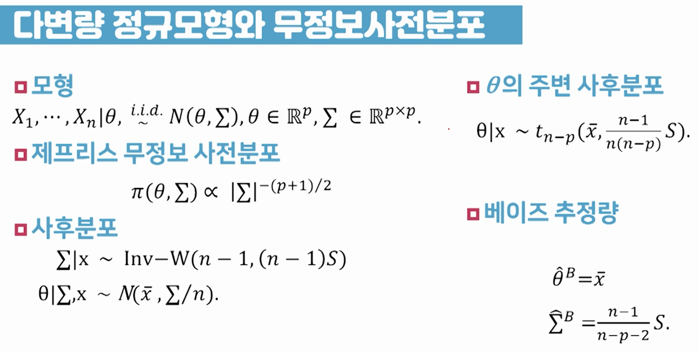

# 06강 다변량 정규모형

## 01 다변량 정규모형: 하나의 모수가 고정되었을 때

  

- 사전분포는  가 아니라  임(오타)

- 0">: 벡터 Σ(시그마)가 '양의 정부호'라는 의미
  - 0\;\Leftrightarrow\;a'\Sigma a>0,\;\;\; a\neq0, a\in\mathbb{R}^P">

  

  

- p-1, B\in\mathbb{R}^{P\times P}">

-  식에서
  - |W|: W의 행렬식(determinant)
  - tr(A): A의 대각원소의 합
  - 는 의 오타임

- 예제에서는 역위샤트 분포를 분산을 나타내는 벡터 Σ(시그마)의 사전분포로 사용

  

- 은  의 오타임

  

## 02 다변량 정규모형: 두 개의 모수를 모두 모를 때

  

- S는 Σ의 최대가능도 추정량

  

  
