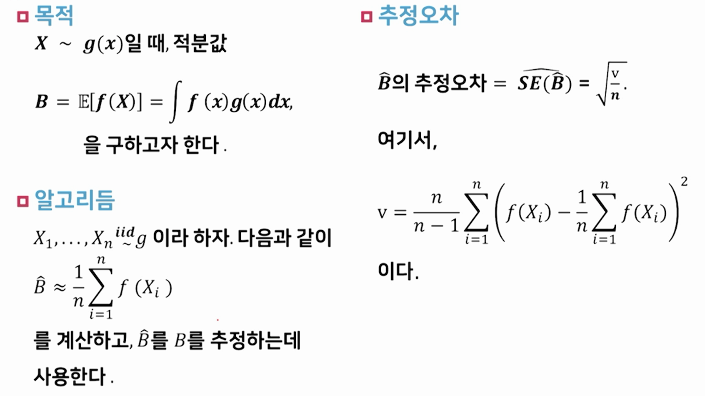
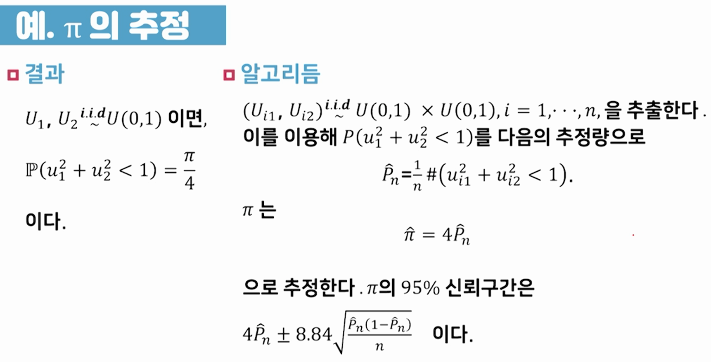
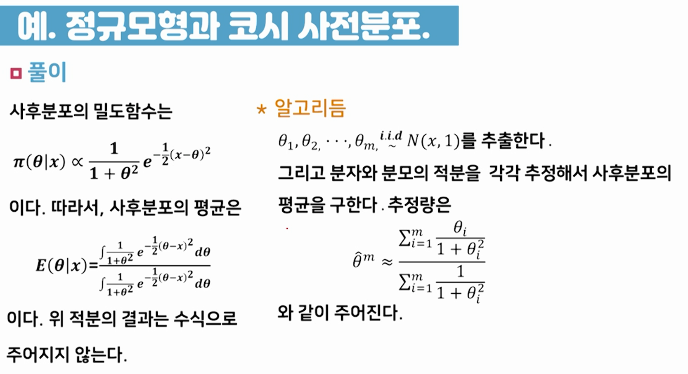
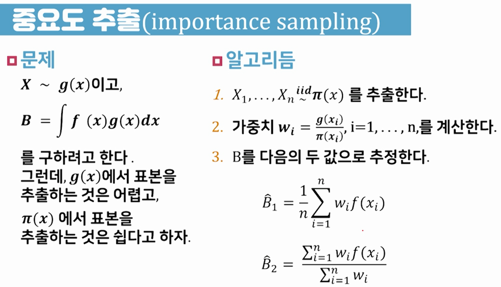
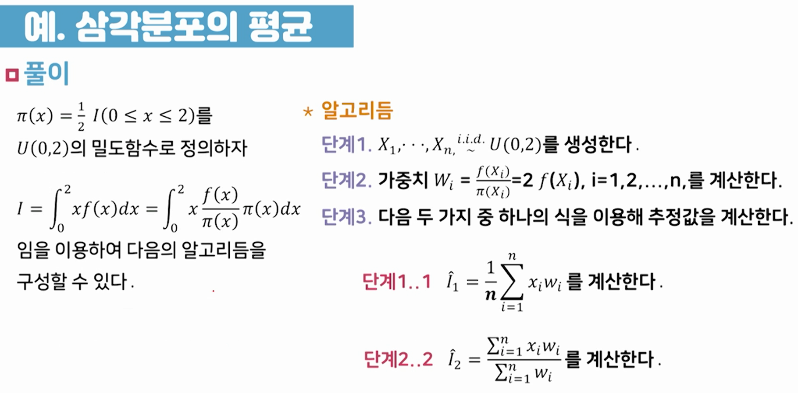

# 07강 몬테카를로 방법

- [몬테카를로 방법의 의미]
  - 베이즈통계는 3가지 요소로 구성되어 있음
    - ① 사전분포, ② 모형(혹은 가능도), ③ 사후분포
    - 사후분포는 모수에 대한 자료를 본 후에, 모수에 대한 정보를 포함한 모수에 대한 분포(θ)
      - 우리가 한 일은 사후분포를 계산하는 방법들을 배우고, 계산해 본 것
      - 사후분포를 계산하면 사후분포를 계산해서 추론을 할 수 있기 때문
      - 모수 추정량도 구했고, 신용집합도 구했고, 가설검증도 할 수 있음
  - 지금까지 다루었던 모형들은 많지 않음
    - 정규모형에서 모수가 하나가 고정 되었을 때와 둘 다 모를 때
    - 다변량 정규모형에서도 모수가 하나가 고정 되었을 때와 둘 다 모를 때
    - 그리고 이항모형
    - 이 정도의 모형들을 다루었음
    - 이 모형들에서는 우리가 켤레 사전분포를 쓰면 사후분포를 손으로 계산할 수 있었음
      - 그래서 계산된 사후분포를 이용해서 추정량도 구하고 신용집합도 구하고 그럴 수 있었음
  - 그런데 사후분포를 손으로 계산할 수 있는 경우는 여기까지가 거의 다임
    - 물론, 이외에도 몇가지 구할 수 있는 경우들이 있는데 그렇게 많진 않음
    - 그래서 실질적으로 우리가 구하고자 하는 사후분포들 중에서 식으로 구할 수 있는 것은 여기까지가 거의 다임
  - 그럼 우리가 실질적인 자료분석을 하려면 어떻게 해야 하느냐?
    - 손으로 구할 수 없는 사후분포가 대부분이죠.
    - 그러면 결국은 사후분포를 '근사'를 해야 합니다.
    - 분포를 근사하는 가장 좋은 방법은 분포에서 랜덤넘버를 생성하는 거죠.(=난수를 발생하는 방법)
    - 그래서 우리는 사후분포를 근사하는 방법의 가장 기본적인 방법의 하나로 몬테카를로 방법에 대해서 이야기할거고, 결국은 사후분포에서 난수를 발생시켜서 우리가 원하는 값, 사후분포의 평균 혹은 분위수 들을 계산하는 방법을 배우도록 하겠습니다.  

## 01 난수발생

- 난수를 발생하는 방법에는 몇 가지가 있는데 가장 많이 쓰는 방법 중의 하나가 역함수방법임
- 역함수 방법
  - F는 역함수가 존재하는 누적분포함수라 하자.
  - U ~ U(0,1) 이라면  이다.
  - 예) 지수분포
  
  
  

- 합격-불합격 방법(acceptance-rejection method)
  - 목적과 상황
    - 밀도함수 f에서 난수를 발생시키고자 한다.
      f에서 직접 난수를 발생시키는 것은 어렵지만,
      아래의 조건을 만족하는 밀도함수 g에서 난수를 발생시키는 것은 쉽다고 하자.
      0">
      여기서 M>0 은 상수이다.
  - 알고리즘
    - ① X ~ g와 U ~ U(0,1)를 발생시킨다.
    - ② 이면, Y=X이라 하고, 그렇지 않으면 1로 돌아간다.

- 예: 삼각분포에서의 확률변수의 생성
  - 다음의 확률밀도함수에서 확률변수를 생성하는 문제를 고려해 보자
    -  이고,
    -  라고 정의하면
    -  임을 알 수 있다.
  - 알고리즘
    - 단계1: X ~ U(0,2), U ~ U(0,1) 을 생성한다.
    - 단계2: 합격비율 f(X)를 계산한다.
    - 단계3: U ≤ f(X) 이면 Y=X 를 반환하고, 그렇지 않으면 단계 1로 돌아간다.

## 02 몬테카를로 방법





- π의 95% 신뢰구간을 구하는 식 에서 8.84는 7.84의 오타임
  -  가 맞는 식임

- 예: 정규모형과 코시 사전분포
  - 문제
    -  이고,
      사전분포가  일 때,
      사후분포의 평균을 구해보자.



- 중요도 추출



  - 은 B의 불편추정량이지만,  은 불편추정량이 아니다. 하지만 편이는 크지 않다.
  - 을 구하기 위해서는 가중치를 정확히 알아야 한다. 반면에 를 구하기 위해서는 가중치가 모르는 상수의 곱으로 나타나도 상관없다.
    즉, 을 구하기 위해서는 g(x)를 정확하게 알아야 하지만, 를 구하기 위해서는 g(x)=(모르는 상수)×(아는 함수형태) 이어도 상관없다.
  - 중요도추출은 g(x)에서 표본을 추출하기 어려울 때 사용할 수 있다.

- 예: 삼각분포의 평균
  -  
    라고 할 때,
  -  
  
    를 중요도추출을 구하는 방법에 대해 알아보자.



## 03 실습

```r
n = 1000
u1 = runif(n)
u2 = runif(n)
phat = mean(u1^2 + u2^2 < 1)
pihat = 4*phat; pihat
cihw = 7.84 * sqrt(phat*(1-phat)/n)
ci = c(pihat-cihw, pihat+cihw); ci
```


