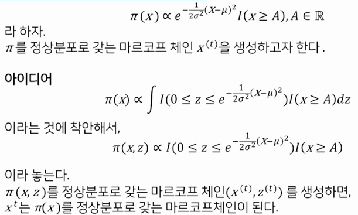

# 09 깁스추출법

## 01 깁스추출법

- 고차원 확률변수 생성의 문제점
  - 삼각분포에서 합격불합격 방법으로 확률변수의 생성
    - 삼각분포의 밀도함수
    
    - 제안분포
    
    - 합격율
    
  - p차원 삼각분포에서 합격불합격 방법으로 확률변수의 생성
    - 삼각분포의 밀도함수
    
    - 제안분포
    
    - 합격율
    

  - 차원이 커질수록 확률을 생성하기가 현실적으로 어려워진다.

- 깁스추출법 알고리즘
  - 깁스추출법은 다변량 분포함수에서 확률변수를 추출하는 알고리즘이다.
  - p차원 확률변수를 한번에 생성하지 않고, 한번에 하나의 원소를 조건부 분포에서 추출한다.
  - 생성된 확률변수의 열은 목표분포  를 정상분포로 하는 마르코프체인이 된다.
  - 여기서 잠깐1: 마르코프 체인이 뭐야?
    - : 마르코프 체인(Markov Chain, MC)
    
  - 여기서 잠깐2: 정상분포라는게 뭐야?
    - 의 분포가 변하지 않는 것을 정상분포라고 한다.
    - 의 분포는 
      - (1) 의 분포와
      - (2) 에 의존 
        - K: 전이확률분포, 전이핵, 전이커널, transition kernel
    - π가 마르코프체인 의 정상분포다 라고 하는 것은
     (= 의 주변분포가 π)
  - 이 얘기는 무슨 얘기냐 하면, 우리가 깁스 추출법을 활용해서 를 뽑았어요. 그러면 이 가 마르코프 체인이 돼요. 그리고 의 주변분포가 π를 따른다 그런 뜻입니다.
    - 몬테카를로 방법에서 i.i.d인 경우에는 가 π를 따르고 들이 독립이었죠.
    - 근데 여기서는 가(=의 주변분포가) π를 따르는 것은 동일한데  간에 서로 종속성이 생긴 겁니다.
    - 그런 뜻입니다.    
  <br>
    - (그럼에도 불구하고) 적당한 조건하에서 깁스 알고리즘 결과인  의 표본적률과 표본분위수는  의 적률과 분위수로 수렴한다.
    - 이게 핵심인 결과입니다. 이 얘기를 다시 얘기하면, 깁스 알고리즘의 결과는 비록 마르코프 체인이지만(=서로 독립은 아니지만) 우리가 몬테카를로 방법에서 i.i.d 표본을 사용했던 것처럼 들의 표본적률과 표본분위수로 π의 적률과 분위수를 근사할 수 있다. 그런 뜻이 됩니다.
    - 그래서 실제로 사용하는 입장에서는 그냥 i.i.d 샘플처럼 사용하면 됩니다. 거기에 약간의 다른 점들이 있긴한데, 개념적으로는 i.i.d 샘플처럼 표본적률과 표본분위수를 이용해서 사후분포의 적률과 분위수를 구한다. 이렇게 생각하시면 되겠습니다.
  - 깁스추출법의 장점
    - 다변량 확률변수의 생성을 1차원 확률변수의 생성 문제로 바꾸었다.

- 깁스 알고리즘
  - 초기값  을 선정한다.
  - t=1,2,3,... 에 대하여
  - 단계 1:  을 추출한다.
  - 단계 2:  을 추출한다.
     
  - 단계 3:  을 추출한다.
  - 단계 4:  을 추출한다.

- 예: 이변량 정규분포


- 예: 절단된 정규분포




## 02 수렴진단

- 번인과 가늘게하기
  (1) 번인(Burn-in)
  - MCMC 표본의 앞부분을 버리는 것을 말한다.

  (2) 가늘게 하기
  - MCMC 표본의 자기상관계수가 높을 때, 모든 표본을 다 사용하지 않고, r번째 표본만 따로 추출해서 사용하는 것을 말한다.
  가늘게 하기로 컴퓨터의 메모리를 절약할 수 있다.

- 시계열그림과 자기상관계수 그림을 이용한 수렴진단
  

## 03 실습
- 문제
   

- 답변
  

```r
# 파라미터 값들을 정한다.
m=5000
mu1=0
mu2=0
sig1=1
sig2=1
rho=0.5
# 깁스 샘플러의 초기화
po.x1 = NULL
po.x2 = NULL
x1= mu1
x2= mu2
# 깁스추출
for(j in 1:m) {
  cmean = mu1 + rho*sig1/sig2*(x2-mu2)
  csd=sig1*sqrt(1-rho^2)
  x1=rnorm(1, cmean, csd)
  cmean = mu2+rho*sig2/sig1*(x1-mu1)
  csd=sig2*sqrt(1-rho^2)
  x2=rnorm(1, cmean, csd)
  po.x1=c(po.x1, x1)
  po.x2=c(po.x2, x2)
}
```
```r
# coda를 이용한 요약통계량과 그림들
library(coda)
library(dplyr)
post.mcmc=as.msms(post.df)
summary(post.mcmc)
summary(post.mcmc, quantile=c(0.05, 0.25, 0.5, 0.75, 0.95))
densplot(post.mcmc)
traceplot(post.mcmc)
autocorr.plot(post.mcmc)

# 변수를 선택할 때
post.df %>% select(x1)
%>% as.mcmc %>% traceplot

# rho와 확률의 추정
post.df %>% mutate(x12=x1*x2, pr=as.numeric(x1>0 & x2>0)) %>% as.mcmc %>% summary

# ggmcmc를 이용한 요약통계량과 그림들
library(ggmcmc)
ggs.post=ggs(post) # mcmc.list를 ggmcmc로 쓸 수 있는 tbl_df 객체로 만든다.
ggs_density(ggs.post)
ggs_traceplot(ggs.post)
ggs_autucorrelation(ggs.post)

# 변수를 선택할 때
post.df %>% select(x1) %>% as.mcmc %>% ggs %>% ggs_traceplot
```


