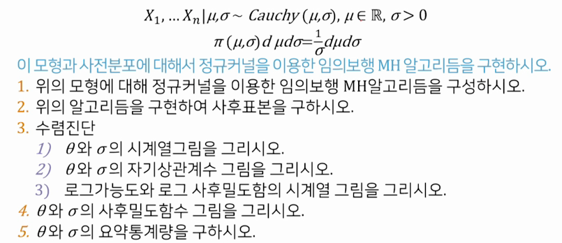
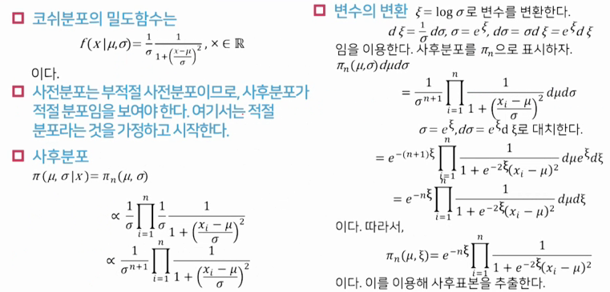
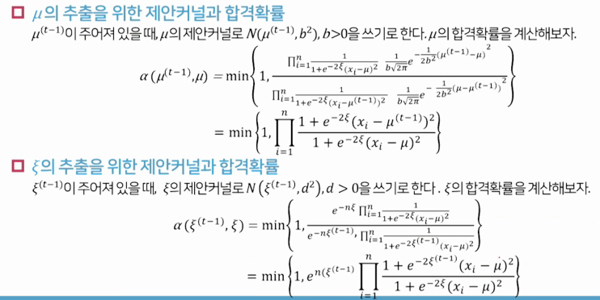

# 10 메트로폴리스-헤이스팅스 알고리즘

## 01 메트로폴리스-헤이스팅스 알고리즘

### 메트로폴리스-헤이스팅스 알고리즘의 유도

- 목표
  - 주어진 목표 분포 를 정상분포(stationary distribution)으로 갖는 마르코프체인의 커널 K(x,dy)를 구하고자 한다.

- 상세평형조건(Detailed balance condition)
  - 상세평형조건
  
  을 만족하면 가 커널 K(x,dy)의 정상분포가 된다.
  - 여기서, 은
  즉, (x로 갈 확률) × (x에서 y로 갈 확률) 이고,
  - 은

    즉, (y로 갈 확률) × (y에서 x로 갈 확률) 이다.

- 문제
  - q(x,y)가 주어진 임의의 커널이라고 하자. q(x,y)로부터 상세평형조건을 만족하는 커널 K(x,y)를 구할 수 있나?
-  \pi(y) q(y,x)"> 이라고 가정하자.
  - 라 하면,
   
  가 만족한다.

- 위의 식을 이용해서 커널을 구할 수 있다. 상세평형조건이 성립하지 않게 하는 확률만큼 자기자신으로 되돌린다.
- 메트로폴리스-헤이스팅스(Metropolis-Hastings) 커널은
  -  
  와 같이 정의된다.
  - 여기서,
  
  
- 위의 식에서  는 밀도함수의 상수배이어도 된다.

### 메트로폴리스-헤이스팅스 알고리즘

- 단계1: (초기화) 를 정한다.
- 단계2: (메트로폴리스-헤이스팅스 반복)
  t= 1,2,...,m에 대해서 다음을 수행한다.
  - (1) (후보값과 균등확률변수 추출) 서로 독립이 되도록 x, u를 추출한다.
    
    
  - (2) (합격확률의 계산)
    
  - (3) \alpha(x^{(t-1)},x)\end{pmatrix}">값의 결정 

- 정리
  - 메트로폴리스-헤이스팅스 알고리즘은 상세평형조건을 만족한다.
  - 즉, 

### 메트로폴리스-알고리즘의 예

- 임의보행 메트로폴리스-헤이스팅스(random-walk MH)
  - 0에 대해 대칭인 분포 g에 대해, 제안 커널이 의 형태를 가지면, 이를 통해 생성되는 MH 커널을 임의보행 메트로폴리스 커널이라고 한다.
  - 예) 많이 쓰는 예는 와  가 있다. 여기서 d>0 이다.

- 독립 메트로폴리스-헤이스팅스(independent MH)
  - 어떤 분포 g에 대해, 제안 커널  와 같아서, 체인의 이전 값  에 의존하지 않을 때 이로부터 생성되는 MH 커널을 독립 MH커널이라고 한다. 이 경우 인 것이 좋다.

## 02 실습: 코쉬 모형

- 문제: 코쉬 모형

  - 코시분포의 밀도함수
    - 의 밀도함수: 
    - 의 밀도함수: 

- 코쉬 모형: 사후분포의 유도


- 코쉬 모형: 임의보행 알고리즘


  - 단계1: (초기화)  로 정한다.
  - 단계2: (MH단계) t=1,2,...,m 에 대해 다음을 수행한다.
    - (1) 의 추출
      1. 아래의 분포에서 를 추출한다.
        
        
      2. 를 꼐산한다.
      3.  이면,  그렇지 않으면 로 놓는다.
    - (2) 의 추출
      1. 아래의 분포에서 를 추출한다.
        
        
      2. 를 계산한다.
      3.  이면  그렇지 않으면  로 놓는다.

- 코쉬모형 by r

```r
# 자료
x = rauchy(10, location=1, scale=2)
n = length(x)

# MH 샘플러의 초기화
m = 5000
mu.jump = 2
xi.jump = 2
po.mu = NULL
po.xi = NULL
mu = median(x)
sig = mad(x)
xi = log(sig)

# 사후표본 추출
for(j in 1:m) {
  muc = rnorm(1, mu, mu.jump)
  u = runif(1, 0, 1)
  log.accept.mu = sum(log((1+exp(-2*xi)*(x-mu)^2)/(1+exp(-2*xi)*(x-muc)^2)))
  if(u < exp(log.accept.mu)) mu=muc
  xic = rnorm(1, xi, xi.jump)
  u = runif(1, 0, 1)
  log.accept.xi = n**(xi-xic)+sum(log((1+exp(-2*xi)*(x-mu)^2)/(1+exp(-2*xic)*(x-mu)^2)))
  if(u < exp(log.accept.xi)) xi = xic
  po.mu = c(po.mu, mu)
  po.xi = c(po.xi, xi)
}

po.sig = exp(po.xi)
post.df = data.frame(mu=po.mu, sig=po.sig, xi=po.xi)

# 사후표본의 요약
library(dplyr)
library(coda)
library(ggmcmc)

post.df %>% as.mcmc %>% summary
post.df %>% as.mcmc %>% ggs %>% ggs_density
post.df %>% as.mcmc %>% ggs %>% ggs_traceplot
post.df %>% as.mcmc %>% ggs %>% ggs_autocorrelation
```


