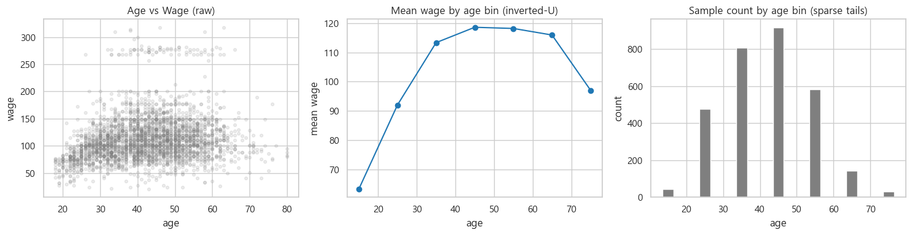
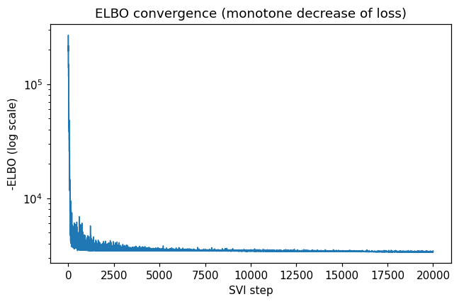
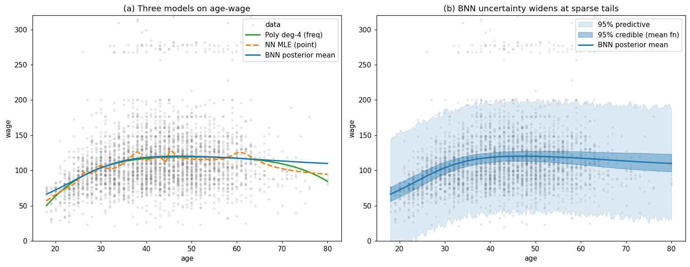
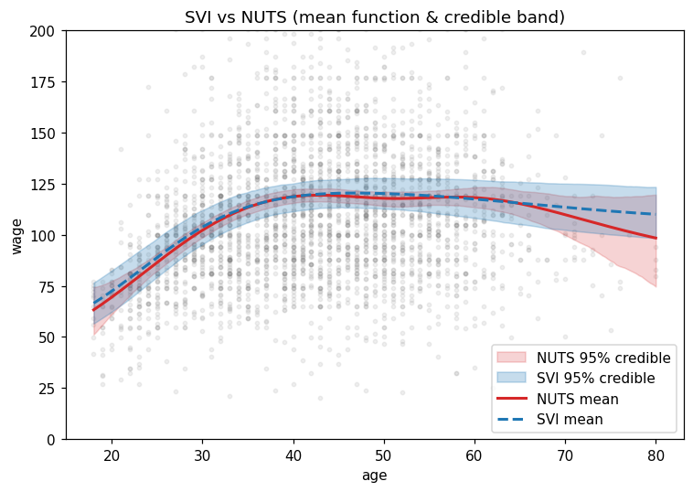
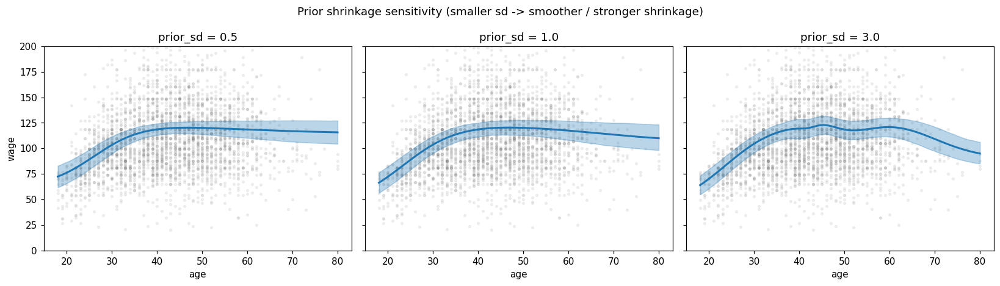

# 베이지안 신경망을 이용한 임금–연령 프로파일의 비선형 추정과 불확실성 정량화

**베이지안 기계학습 기말 보고서**

---

## 초록 (Abstract)

전통적 신경망은 최대가능도(MLE)로 가중치를 단일 값으로 추정하므로 예측의 불확실성을
표현하지 못한다. 본 보고서는 미국 임금 자료(ISLR `Wage`, n=3,000)의 대표적 비선형
관계인 **연령–임금 프로파일(역U자)** 을 대상으로 (1) 다항회귀, (2) 일반 신경망(MLE),
(3) **베이지안 신경망(BNN)** 을 비교하였다. 세 모형의 평균 예측 정확도(test RMSE)는
약 40으로 유사했으나, **불확실성의 표현에서 결정적 차이**가 나타났다. BNN은 데이터가
풍부한 중년층에서 좁고(42세: 신용구간 폭 13.7) 희박한 청년·고령층에서 넓은(20세: 20.1,
78세: 24.6) 신용구간을 자동으로 부여하여, "모르는 곳에서 모른다고 말하는" 베이지안
추론의 본질을 보였다. 변분추론(SVI)의 근사 품질은 NUTS(HMC)로 교차검증하였고
(σ의 $\hat R=1.001$), 사전분포 수축 강도에 따른 민감도를 함께 분석하였다.

---

## 1. 서론

### 1.1 연구 동기

신경망(MLP)은 임의의 매끄러운 함수를 근사할 수 있는 강력한 도구이지만, 표준적 학습은
손실을 최소화하는 **하나의 가중치 집합**만 찾는다(MLE). 데이터를 똑같이 잘 설명하는
다른 가중치 조합의 가능성은 버려지며, 그 결과 예측의 신뢰도를 정량화할 수 없다.
베이지안 신경망(BNN, 12강)은 가중치 $w$ 에 사전분포 $p(w)$ 를 부여하고 사후분포
$p(w \mid \mathcal{D})$ 를 추론하여, **베이지안 모델 평균(BMA)** 을 통한 예측과
**불확실성의 정량화**를 동시에 달성한다.

### 1.2 분석 대상

노동경제학에서 임금은 연령(경력)에 따라 상승하다 정점 후 완만해지는 **역U자(concave)**
프로파일을 보인다. 선형모형으로는 포착 불가능한 이 구조는 신경망이 자동 학습하기에
적합하다. 또한 표본이 중년층에 집중되고 청년·고령층은 희박하므로, **불확실성이 연령
구간에 따라 어떻게 달라지는지**를 보여주기에 이상적인 사례다.

---

## 2. 데이터 및 탐색적 분석

ISLR `Wage` 자료(3,000명)에서 종속변수는 임금(`wage`), 설명변수는 연령(`age`)을 사용했다.
연령대별 평균임금은 18세 부근 76에서 시작해 40대 중반 119로 정점에 이른 뒤 60대 이후
113으로 감소하는 전형적 역U자였다. 동시에 표본 수는 중년층(35~50세, 구간별 449~466명)에
집중되고 양 끝(18~25세 231명, 60세 이상 173명)은 희박하다.

*그림 1. (좌) 원자료 산점도, (중) 연령대별 평균임금의 역U자, (우) 연령대별 표본 수.
양 끝 구간의 표본이 적다는 점이 이후 불확실성 분석의 핵심 배경이다.*

임금 분포에는 100~150 부근의 주 군집 외에 250 이상의 **고소득 군집**이 별도로 존재하는
이봉(bimodal) 구조가 있다. 이는 연령 단독으로 설명되지 않는 이질성으로, §6에서 단일 정규
가능도의 한계로 논의한다. 분석에서는 연령·임금을 표준화하고 80/20으로 학습·검증 분할
(학습 2,400 / 검증 600)하였다.

---

## 3. 방법론

### 3.1 베이지안 신경망 모형

표준화된 연령 $x$ 에 대해 은닉층 1개(유닛 $H=16$, tanh)를 가진 신경망 $f_w(x)$ 로
임금을 모형화한다.

$$
y_i \mid w, \sigma \sim \mathcal{N}\!\big(f_w(x_i),\, \sigma^2\big), \qquad
f_w(x) = w_2^\top \tanh(w_1 x + b_1) + b_2 .
$$

가중치·절편에는 가우시안 사전분포 $w \sim \mathcal{N}(0, s^2)$, 잡음 표준편차에는
$\sigma \sim \text{HalfNormal}(1)$ 을 부여한다. 사전 표준편차 $s$ 는 가중치를 0으로
당기는 **수축(shrinkage)** 강도를 조절하며(12강 4절의 규제 효과), §5.3에서 민감도를
분석한다.

### 3.2 변분추론(SVI)과 ELBO

사후분포 $p(w, \sigma \mid \mathcal{D})$ 는 직접 계산이 불가능하므로, 다루기 쉬운
변분분포 $q_\lambda$(대각 정규근사, mean-field)로 근사하고 **증거하한(ELBO)** 을
최대화한다(9·12강). 본 보고서는 SVI를 주 추론기로 사용하고, NUTS(HMC, 3강)로 근사
품질을 교차검증한다. 구현은 NumPyro(10강)를 사용하였다.

---

## 4. 모형 적합

세 모형 모두 동일한 평균함수(역U자)를 잡아냈다.

- **다항회귀(4차, 빈도주의):** ISLR 표준 방식. 검정 RMSE 39.98. 평균함수의 신뢰구간은
  4차 모형이 참이라는 가정 하의 좁은 구간이다.
- **일반 신경망(MLE, PyTorch):** BNN과 동일 구조(은닉 16×2, tanh). 검정 RMSE 40.32.
  가중치를 단일 값으로 추정하여 **불확실성이 전혀 없다.**
- **베이지안 신경망(SVI, NumPyro):** 검정 RMSE 40.03. ELBO가 139,502 → 3,382로
  단조 감소·수렴하였다(그림 2).

*그림 2. SVI 학습 중 손실(−ELBO)의 단조 감소. 수렴 진단 및 코드 정합성 점검 지표로
활용된다(9강).*

### 4.1 핵심 결과: 불확실성의 연령별 구조

BNN의 95% 신용구간(평균함수) 폭은 데이터 밀집 구간에서 가장 좁고 희박한 양 끝에서
넓어졌다.

| 연령 | 사후평균 임금 | 95% 신용구간 폭 |
|:--:|:--:|:--:|
| 20세 | 72.0 | 20.1 |
| 30세 | 104.1 | 16.5 |
| **42세** | 119.6 | **13.7 (최소)** |
| 60세 | 117.4 | 18.7 |
| 78세 | 110.5 | 24.6 |

*표 1. 신용구간 폭이 중년층(42세)에서 최소이고 청년·고령층으로 갈수록 넓어진다.
이는 BNN이 데이터 희박 구간에서 외삽 위험을 정직하게 드러냄을 의미한다.*

### 4.2 NUTS(HMC) 검증 및 수렴 진단

SVI 근사의 타당성을 NUTS 샘플링(2체인 × 표본 500)으로 검증했다. **유의점:** BNN의
가중치는 부호·치환 대칭으로 **비식별(non-identifiable)** 이므로 가중치 자체의 $\hat R$ 은
의미가 없다. 따라서 식별 가능한 양인 **잡음 $\sigma$** 와 **함수값 $f(x)$** 에 대해
진단하였다(3·10강).

- $\sigma$: 사후평균 0.956, $\hat R = 1.001$, $n_{\text{eff}} = 1{,}012$
- $f(\text{age})$: 20·42·78세 모두 $\hat R \approx 1.000$, $n_{\text{eff}} \approx 900\text{–}1{,}000$

모두 수렴 기준($\hat R \approx 1$)을 충족하여, 함수공간에서의 추론이 안정적임을 확인했다.

---

## 5. 결과 시각화

### 5.1 세 모형 비교와 BNN의 불확실성

*그림 3. (a) 세 모형의 평균함수는 역U자에서 거의 일치한다. (b) BNN의 95% 신용구간(진한
영역, 평균함수의 불확실성)과 95% 예측구간(연한 영역, 잡음 포함)이 데이터가 희박한
청년·고령 구간에서 넓어진다.*

### 5.2 SVI와 NUTS의 일치

*그림 4. SVI와 NUTS의 평균함수·신용구간은 데이터가 풍부한 20~60세에서 거의 일치하며,
표본이 극히 적은 70세 이상에서만 차이가 나타난다. 즉 **정보가 있는 곳에서는 두 추론기가
일치하고, 불확실한 곳에서만 차이**가 발생한다. 이는 빠른 SVI 근사가 본 문제에서 신뢰할
만함을 뒷받침한다.*

### 5.3 사전분포 수축 강도 민감도

*그림 5. 가중치 사전 표준편차 $s$ 의 영향. $s=0.5$(강한 수축)는 매끄럽고 단순한 함수를,
$s=3.0$(약한 수축)은 국소 굴곡까지 잡는 유연한 함수를 산출한다. 이는 규제(regularization)의
베이지안적 해석에 해당한다(12강).*

---

## 6. 비교 및 논의

| 모형 | 검정 RMSE | 비선형 | 불확실성 표현 |
|:--|:--:|:--:|:--|
| 다항회귀(4차) | 39.98 | O(차수 고정) | 신뢰구간(평균함수만) |
| 일반 신경망(MLE) | 40.32 | O | 없음 |
| **베이지안 신경망(SVI)** | 40.03 | O | **신용구간 + 예측구간** |

*표 2. 세 모형 비교 요약.*

- **예측 정확도는 비슷하다.** 연령 단독으로 설명되는 임금 변동이 제한적이고(임금의
  이질성·이봉구조), 세 모형 모두 동일한 역U자 평균함수를 잡아내기 때문이다. 이 사례에서
  BNN의 가치는 *점예측 정확도*가 아니라 **불확실성의 표현**에 있다.
- **불확실성의 구조적 차이.** 다항회귀의 신뢰구간은 모형 구조를 참으로 가정한 좁은
  구간이고, 일반 신경망은 불확실성 자체가 없다. 반면 BNN은 데이터 희박 구간에서 신용구간을
  자동으로 넓혀 외삽 위험을 드러낸다(표 1, 그림 3).
- **SVI 근사의 타당성.** SVI와 NUTS의 평균함수·신용구간이 데이터 풍부 구간에서 일치하여,
  계산이 빠른 변분근사가 본 문제에서 신뢰할 만함을 확인했다(그림 4).
- **사전분포의 역할.** 수축이 강하면 단순·매끄러운 함수가, 약하면 유연한 함수가 얻어진다
  (그림 5) — 규제의 베이지안적 해석.
- **한계와 확장.** 임금의 이봉구조는 단일 정규 가능도로 포착되지 않는다.
  (i) 학력·성별 등 공변량을 입력에 추가, (ii) 분산을 입력의 함수로 두는 **이분산
  (heteroscedastic)** 가능도, (iii) **혼합밀도(mixture density)** 출력으로 확장하면
  개선될 수 있다.

---

## 7. 결론

연령–임금이라는 비선형 회귀 문제에서 다항회귀·일반 신경망·베이지안 신경망을 비교한 결과,
세 모형의 평균 예측은 유사했으나 **불확실성의 표현에서 결정적 차이**가 드러났다. BNN은
가중치를 분포로 두고 SVI로 사후분포를 근사함으로써, 데이터가 풍부한 중년층에서는 좁고
희박한 청년·고령층에서는 넓은 신용구간을 제공했다. 이는 예측의 신뢰도를 정량화해야 하는
실무(정책·의사결정)에서 점추정만 제공하는 전통적 신경망보다 베이지안 접근이 갖는 본질적
이점이다. NUTS 검증과 사전분포 민감도 분석은 결과의 강건성과 모형 설정의 의미를
뒷받침한다.

---

## 부록: 재현 방법

- 분석 노트북: `BNN_Wage_분석.ipynb` (전체 코드·출력 포함)
- 데이터: `Wage.csv` (ISLR `Wage`, 공개 자료)
- 주요 환경: Python 3.13, NumPyro 0.21, JAX 0.10, PyTorch 2.12(CPU), pandas 3.0, matplotlib 3.10
- 그림: `fig_eda.png`, `fig_elbo.png`, `fig_main.png`, `fig_svi_vs_nuts.png`, `fig_prior.png`
