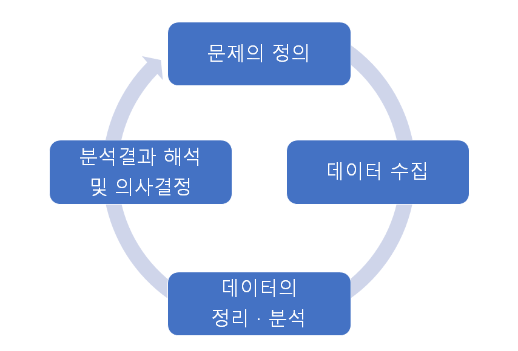

# 제1장 데이터와 통계학

## 1.1 통계학이란
 통계학(statistics): 관심대상에 대해 관련된 데이터를 수집하고, 그 데이터를 요약‧정리하여 이로부터 불확실한 사실에 대한 결론이나 일반적인 규칙성을 찾는 학문

## 1.2 통계학의 역사
 통계학이란 용어는 라틴어의 주(state)를 의미하는 스타투스(status)로부터 유래  
 통계학의 기원은 세금을 부과하기 위해 조사한 가축의 수, 작물의 작황량 조사하는 것 또는 전쟁에 대비하여 청장년 인구수를 조사한 것

## 1.3 통계학의 역할
1) 데이터의 수집 – 통계분석의 가장 중요한 부분
2) 데이터의 요약
3) 데이터로부터 결론을 유도

## 1.4 통계학의 연구분야
 통계학 연구는 기술통계(descriptive statistics)와 추측통계(inferential statistics)로 구분된다.
### 1) 기술통계
 기술통계는 대표되는 몇 개의 숫자로 데이터 전체를 요약하여 양적으로 축소하거나, 정리된 표나 그래프를 통하여 데이터의 특징을 파악하는 것을 목적으로 한다.
### 2) 추측통계
 표본 데이터의 일부를 분석함으로써 전체에 관해 추측하고 일반화시키는 통계적 방법을 추측통계학이라고 한다.

## 1.5 주요 용어
 관심대상 전체를 모두 조사하지 않고 일부만 조사‧관측하여 전체를 파악하는 것은 통계학의 중요한 출발배경이다.
 예시) 국 끓일 때 간 보기, 마트의 시식코너, 의자 사기전에 앉아보기, 결혼 전 상견례, 입사지원 서류 받기 등
### 1) 모집단(population)
 관심대상이 되는 전체
 모집단의 크기가 유한한 경우 유한모집단, 무한한 경우 무한모집단이라 한다.
### 2) 표본(sample)
 실제 조사되거나 측정되는 모집단의 일부
 표본조사를 하는 이유
 ① 전수조사가 시간적‧경제적 여건상 불가능한 경우
 ② 때에 맞추어 조사결과가 제시되어야 조처가 가능한 경우
 ③ 관심 특성값을 파괴해야만 얻을 수 있는 데이터인 경우
 ④ 전수조사를 함으로써 오차개입이 커져서 오히려 정확도를 떨어뜨리는 경우
### 3) 임의추출법
 모집단의 구성요소 하나하나가 표본으로 뽑힐 확률이 같은 상황에서 표본을 뽑는 방법
### 4) 모수와 통계량
 모수(parameter): 모집단에 대한 수치 특성값
 통계량(statistic): 표본에서 얻은 수치 특성값

## 1.6 통계학의 적용과정

{: width="427" height="290")
## 1.7 데이터의 종류
### 1) 데이터란  
 데이터(data): 관심대상이 되는 사물이나 사건의 속성을 일정한 규칙에 의해 측정‧관찰‧조사함으로써 얻은 것  
 단위(unit): 관찰되는 항목이나 대상  
 관찰(observation): 각 조사단위로부터 기록된 정보나 특성  
 변수(variable): 각 단위에 대해서 측정되는 특성  
### 2) 변수의 종류  
 질적 변수(qualitative variable): 조사대상을 특성에 따라 범주로 구분하여 측정한 변수. 범주형 변수(categorical data)라고도 함  
 ‧ 명목형(nominal): 변수가 크기나 순서에 대한 의미가 없고 이름만 의미를 부여할 수 있는 경우  
 ‧ 순서형(ordinal): 변수가 어떤 기준에 따라 순서에 의미를 부여할 수 있는 경우  
 양적 변수(quantitative variable): 길이, 무게와 같이 양적인 수치로 측정되거나 몇 개인가를 세어 측정하는 변수로 덧셈, 뺄셈 등의 연산이 가능  
 ‧ 이산형(discrete): 변수가 취할 수 있는 값을 하나하나 셀 수 있는 경우  
 ‧ 연속형(continuous): 변수가 구간 안의 모든 값을 가질 수 있는 경우  
### 3) 변수의 분포  
 변수의 분포는 어떤 변수가 취할 수 있는 가능한 전체 값에 대해 각 값이 발생할 수 있는 빈도를 표현한 것이다.  
 원시 데이터(raw data): 조사대상의 어떤 특성을 측정하거나 조사하여 수치로 나타내 정리한 것  
 도수분포표(frequency table): 데이터 각 값의 출현도수를 세거나 전체 데이터를 몇 개의 구간으로 나누어 각 구간에 속하는 데이터의 개수를 세어서 정리한 표  
#### (연속형 데이터에 대한) 도수분포표 작성방법
##### 1. 데이터의 개수를 센다.
##### 2. 데이터의 최대값과 최소값을 구한다.
##### 3. 계급의 수를 정한다.
##### 4. 계급의 폭을 구한다.
##### 5. 계급의 경계값과 중심값을 구한다.
##### 6. 도수분포 용지를 준비하고 표를 작성하여 도수를 센다.

## 1.8 질적 데이터에 대한 그래프 표현
### 1) 원그래프
 전체를 구성하는 부분의 구성비를 나타낼 때 적합함
### 2) 막대그래프
 각 범주에 속한 비율을 하나의 막대로 나타낸 그래프

 일반적으로 질적 변수는 변수값의 순서에 의미가 없으므로 비율의 순서로 정렬하여 나타내는 것이 바람직하다.

## 1.9 양적 데이터에 대한 그래프 표현
### 1) 히스토그램
 작성된 도수분포표의 계급을 밑변으로 하고, 그 계급에 포함되는 데이터의 도수에 비례하는 면적을 가진 직사각형을 나열하여 작성한 그래프
### 2) 줄기-잎그림(stem-and-leaf plot; stem plot)
 데이터의 수가 많지 않을 때 데이터의 분포를 빠른 시간 내에 쉽게 나타낼 수 있는 방법이다.
 줄기-잎그림은 히스토그램과는 달리 데이터의 원래 값을 그대로 갖고 있다.
 줄기-잎그림의 작성방법
#### 1. 각 원시 데이터를 줄기와 잎 부분으로 나눈다. 일반적으로 잎은 한 자릿수 마지막 자리이고, 줄기 부분은 하나 이상의 자릿수를 차지한다.
#### 2. 줄기를 아래로 나열하여 쓴다.
#### 3. 데이터마다의 잎을 해당되는 줄기에 정렬한다.
#### 4. 잎의 수치를 크기순으로 정렬한다.
### 3) 점도표
 점도표(dot plot): 실선 위에 데이터의 분포를 빠른 시간 내에 나타낼 수 있는 간단한 그래프

 그래프를 작성하여 다음과 같은 사항을 검토하면 데이터의 특징에 대한 좀 더 세부적인 정보를 얻을 수 있다.  
 ① 데이터의 중심위치는 어디인가?  
 ② 데이터의 산포는 큰가?  
 ③ 분포는 대칭인가 또는 한쪽으로 치우쳤는가?  
 ④ 분포의 봉우리는 하나인가, 둘인가?  
 ⑤ 동떨어진 이상한 데이터(특이점)는 없는가?  

 특이점(이상치, outlier): 대부분의 데이터가 모여 있는 군집(cluster)으로부터 멀리 떨어져 있는 데이터

#### 분포의 유형  
##### (1) 일반형  
 가장 일반적인 분포. 종모양이고, 좌우가 대칭이며, 데이터가 가운데에 집중적으로 모여있는 형태  
##### (2) 쌍봉우리형  
 두 가지 다른 요인이 작용한 결과 분포의 봉우리가 두 개로 나뉘어 있는 형태  
##### (3) 치우침형  
 봉우리는 하나인데, 왼쪽/오른쪽으로 치우친 형태  
##### (4) 균일형  
 어떤 범위 내의 값이 동일한 빈도로 나타나는 경우  
 
### 4) 시계열그래프
 시계열그래프(time series plot): 시간의 변화에 따른 경향을 파악할 목적이거나 데이터가 수집된 순서에 따라 데이터를 정리해야 할 때 널리 사용되는 그래프

## 1.10 도표와 그래프 작성 시 유의사항  
 ① 그래프에 적합한 제목을 붙여야 한다  
 ② 데이터의 출처와 표본크기 및 수집방법에 대한 사항을 포함해야 한다  
 ③ 축에 대한 제목을 명확히 달아야 한다  
 ④ 도수, 비율, 퍼센트 등이 0에서 시작하는지를 점검해야 한다  
 ⑤ 축이 연속적으로 이어지는지 또는 중간에 끊기는지 점검해야 한다  
 ⑥ 변수의 측정단위가 표시되어야 한다.  

## 1.11 R Commander를 이용한 실습
< 생략 >
