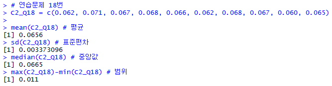
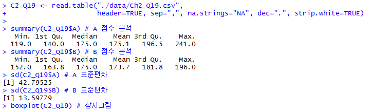
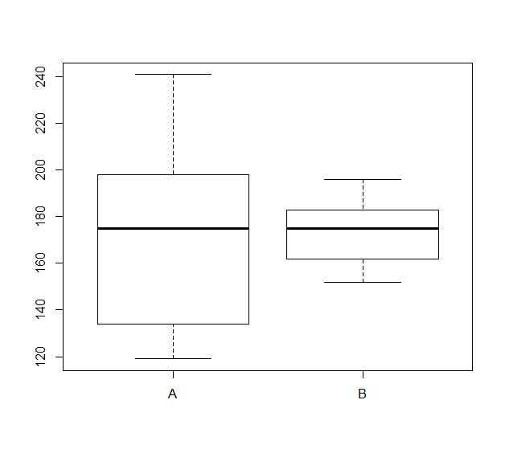

#### 15. 미국 역대 대통령의 첫 취임식 때의 연령이 다음과 같다.  
57, 61, 57, 58, 57, 61, 54, 68, 51

(1) 첫 취임식 때의 연령의 평균을 구하라.  
(2) 첫 취임식 때의 연령의 최빈값을 구하라.  
(2) 첫 취임식 때의 연령의 중앙값을 구하라.  

<풀이>
``` R
C2_Q15 = c(57, 61, 57, 58, 57, 61, 54, 68, 51)

# 최빈값을 구하는 Mode 함수
Mode <- function(x) {
  ux <- unique(x)
  ux[which.max(tabulate(match(x,ux)))]
}

mean(C2_Q15) # 평균
Mode(C2_Q15) # 최빈값
median(C2_Q15) # 중앙값
```

<결과>


#### 16. 다음은 서울시의 구별로 할당된 자문위원수이다.  
92, 107, 353, 90, 78, 92, 102, 86, 106, 109, 95, 102, 91  
#### 이 데이터의 평균과 중앙값을 구하고, 이 두 대표값 중 데이터의 중심위치를 나타내는 데 어떤 것이 좋은가를 설명하라.

<풀이>
``` R
C2_Q16 = c(92, 107, 353, 90, 78, 92, 102, 86, 106, 109, 95, 102, 91)

mean(C2_Q16) # 평균
median(C2_Q16) # 중앙값
```

<결과>


이 데이터의 **평균은 이상치(353)의 영향을 크게 받기 때문에 중앙값이 보다 나은 대표값**으로 판단된다.

#### 17. 배기용량이 같은 세 가지 자동차 기종을 대상으로 고속도로를 달리도록 하여 1갤런의 기름으로 갈 수 있는 거리를 조사하여 다음 결과를 얻었다.

|차종|   |주행|거리|(km) | |
|----|---|---|-----------|---|---|
|A|34.7|34.4|33.6|33.4|30.9|
|B|34.1|31.7|34.3|31.7|34.2|
|C|32.7|35.1|31.5|32.1|31.6|

(1) 차종별 평균, 중앙값을 구하라.
(2) 두 가지 대표값을 고려할 때 어떤 기종의 기름 효율성이 가장 좋다고 할 수 있는가?

<풀이>
``` R
C2_Q17 <- read.table("./data/Ch2_Q17.csv", header=TRUE, 
                      sep=",", na.strings="NA", dec=".", strip.white=TRUE)

mean(C2_Q17$A) # A 평균
median(C2_Q17$A) # A 중앙값
mean(C2_Q17$B) # B 평균
median(C2_Q17$B) # B 중앙값
mean(C2_Q17$C) # C 평균
median(C2_Q17$C) # C 중앙값
```

<결과>


평균으로 보면 A가 가장 좋지만, 중앙값으로 보면 B가 더 나은 선택이다.

#### 18. 환경공학자가 납의 농도를 10군데의 강에서 측정하여 다음의 데이터를 얻었다.
0.062, 0.071, 0.067, 0.068, 0.066, 0.062, 0.068, 0.067, 0.060, 0.065

(1) 평균과 표준편차를 구하라.
(2) 중앙값과 범위를 구하라

<풀이>
``` R
C2_Q18 = c(0.062, 0.071, 0.067, 0.068, 0.066, 0.062, 0.068, 0.067, 0.060, 0.065)

mean(C2_Q18) # 평균
sd(C2_Q18) # 표준편차
median(C2_Q18) # 중앙값
max(C2_Q18)-min(C2_Q18) # 범위
```

<결과>



#### 19. 다음 두 명의 볼링선수가 10회 게임을 하여 그 점수를 기록한 것이다.

| 선수 A | 선수 B |
|:------:|:------:|
|198|196|
|119|159|
|174|162|
|235|178|
|134|188|
|192|169|
|124|173|
|241|183|
|158|177|
|176|152|

(1) 각 선수의 점수에 대한 평균과 중앙값을 구하라.
(2) 각 선수의 점수에 대한 표준편차를 구하고 상자그림을 그려라.
(3) 누가 더 우수한 선수라고 판단되는가? 그 이유는?

<풀이>
``` R
C2_Q19 <- read.table("./data/Ch2_Q19.csv", 
                     header=TRUE, sep=",", na.strings="NA", dec=".", strip.white=TRUE)

summary(C2_Q19$A) # A 점수 분석
summary(C2_Q19$B) # B 점수 분석
sd(C2_Q19$A) # A 표준편차
sd(C2_Q19$B) # B 표준편차
boxplot(C2_Q19) # 상자그림
```

<결과>





