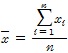

# 제2장 데이터 수치 요약

## 2.1 개요
 이 장에서는 양적 데이터에 대해 분포의 특징을 어떻게 수치로 요약할 것인가에 대해서 살펴본다.

## 2.2 중심위치의 측정
 통계량(statistics): 표본 데이터에서 구한 평균이나 중앙값 등
 모수(parameter): 전체 모집단 데이터에서 구한 평균이나 중앙값 등
### 1) 평균
 (산술)평균(mean) : 조사된 모든 데이터의 총합을 표본의 크기로 나눈 값
 
 
 평균의 특징  
 ① 데이터의 무게중심이나 가운데라는 중심위치로서의 의미를 갖는다.  
 ② 수치로 된 어떤 데이터에 대해서도 계산할 수 있고, 데이터 하나하나가 전부 반영된다.  
 ③ 특이점에 대해 민감하여 대부분의 데이터와는 멀리 떨어진 큰 값이나 작은 값의 영향을 크게 받는다.  
 ④ 하나의 데이터에 대해 오직 하나의 값을 갖는 유일성을 갖고 있다.  

### 2) 중앙값
 중앙값(median): 데이터를 크기순으로 나열할 때 가장 가운데 오는 값
 
 데이터에 특이점이 포함되어 있을 때에는 중심위치를 나타내는 대표값으로 중앙값이 평균에 비해 더 적합함

### 3) 최빈값
 최빈값(mode): 데이터 중에서 발생빈도가 가장 높은 값
 최빈값의 특징  
 ① 따로 계산할 필요가 없어서 쉽게 구할 수 있다.  
 ② 하나의 수치가 두 번 이상 발생하지 않는 경우에는 값이 존재하지 않을 수 있다.  
 ③ 최빈값은 유일하지 않을 수 있다.  

## 2.3 변동의 측정
 데이터가 얼마나 넓게 퍼져 있고 분포되어 있는가는 변동의 측도(measure of variability) 또는 산포의 측도(measure of spread)를 구하여 알 수 있다.
 데이터의 변동을 나타내는 통계량에는 범위, 사분위수범위, 표준편차 등이 있다.
### 1) 범위
 범위(range): 데이터의 최댓값에서 최솟값을 뺀 것
### 2) 사분위수범위
 사분위수범위(interquartile range: IQR): 전체 데이터를 순서대리 정리하여 4등분한 후 데이터의 가운데에 위치한 50% 부분에 대해 범위를 구한 것
 1사분위수(Q1)와 3사분위수(Q3)의 차이
 ※ 1사분위수(Q1): 데이터의 25%가 이 값보다 작거나 같은 지점의 값2사분위수(Q2): 데이터의 50%가 이 값보다 작거나 같은 지점의 값 = 중앙값3사분위수(Q3): 데이터의 75%가 이 값보다 작거나 같은 지점의 값
### 3) 다섯 수치요약
 다섯 수치요약(five-number summary): 최댓값, 최솟값, Q1, Q2, Q3
 상자그림(boxplot): 다섯 수치요약을 그래프로 표현한 것
#### 1. 1사분위수(Q1)와 3사분위수(Q3)를 이용해서 상자를 그린다.
#### 2. 중앙값을 상자의 중앙에 표시한다.
#### 3. 수염이라고 불리는 선을 상자 끝에서부터 최솟값과 최댓값까지 긋는다.

#### 데이터에서 특이점을 발견해 내 상자그림에 표시하는 방법
##### 1. 사분위수범위에 1.5배한 값(step)을 구한다.
  step = 1.5 × IQR
##### 2. 사분위수 Q1과 Q3로부터 1배의 step만큼 떨어진 안울타리(inner fence)라고 부르는 경계값을 각각 구한다.
  Q1 - step, Q3 + step
##### 3. 안울타리 바깥쪽에 있는 관찰값을 특이점이라고 정의한다.
##### 4. 상자그림을 작성할 때 안울타리까지는 수염을, 그 밖의 데이터는 특이점으로 *나 ∘등의 기호로 나타낸다.
### 4) 분산과 표준편차
 분산(variance): 관찰값과 평균의 차이를 구하여 각각을 제곱해 합한 후 데이터의 개수로 나눈 값
 
 ※ 표본분산을 구할 때 n 대신 n-1로 나누는 이유
  ☞ n-1로 나눌 때 모집단의 분산(σ)을 더 잘 추정함
 표준편차: 원시 데이터의 측정단위와 같게 하기 위해 분산의 제곱근을 구한 것

 변이계수(coefficient of variation): 표준편차를 평균으로 나눈 값
 ☞ 두 개 이상의 데이터에 대한 퍼짐 정도를 비교하는데 사용함

## 2.4 R Commander를 이용한 실습
< 생략 >
 
