# 통계학 개론

## 제3장 확률과 확률변수

### 3.1 확률의 정의
- 통계적 실험(statistical experiment): '여러 가지 가능한 결과‘는 알 수 있지만, ’정확히 무슨 결과‘가 발생할지는 모르는 상황
- 표본공간(sample space): 통계적 실험의 모든 가능한 결과의 집합(S)
- 사건(event): 표본공간의 한 부분집합(A, B, C, …)
- 확률(probability): 어떤 사건이 일어날 가능성을 0과 1사이의 수로 표시하는 것

❖ 확률의 고전적 정의
표본공간의 모든 원소가 일어날 가능성이 같다고 하자. 사건 A가 발생할 확률은 이산형(discrete) 표본공간의 경우에  
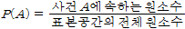  
연속형(continuous) 표본공간의 경우에  
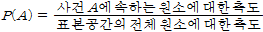  
로 정의한다. 여기서 측도란 길이, 면적, 부피 등을 뜻한다.

❖ 확률의 상대도수적 정의  
사건 A가 발생할 확률(P(A)로 표시)은 같은 조건하에서 통계적 실험을 수없이 반복 시행했을 때 사건 A가 발생하는 비율, 즉 상대도수이다.

❖ 확률의 공리적 정의  
1. 표본공간 S에서 임의의 사건 A에 대하여 0≤P(A)≤1
2. P(S) = 1
3. 서로 배반인 사건 A1, A2, …에 대하여

> P(A1∪A2∪…) = P(A1) + P(A2) + …  

를 만족할 때, P(A)를 사건 A의 확률이라 한다.

### 3.2 확률의 계산
여러 가지 복잡한 경우의 수를 세는 효과적인 방법에는 순열 및 조합이 있다.  
❖ 순열(permutation)  
n개의 사물 중 r개를 선택하여 순서를 고려해 나열하는 방법의 수  
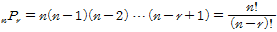
 
❖ 조합(combination)  
n개의 사물 중 r개를 순서를 고려하지 않고 추출하는 방법의 수  
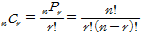
 
❖ 확률의 덧셈법칙  
> P(A∪B) = P(A) + P(B) - P(A∩B)

※ 만일 A∩B = ∅ 이면 P(A∪B) = P(A) + P(B) 이고, 사건 A, B를 서로 배반사건(mutually exclusive events)이라고 한다.

❖ 조건부 확률(conditional probability)  
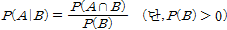

❖ 확률의 곱셈법칙  
P(A) > 0, P(B) > 0 이면,

> P(A∩B) = P(A)P(B|A) = P(B)P(A|B)

이다. 만일 P(B|A) = P(B) 이면 사건 A와 B를 서로 독립사건(independent event)이라고 한다. 이때는

> P(A∩B) = P(A)P(B)

로 쓸 수 있다.

❖ 여사건을 이용한 확률계산  
A를 사건 A의 여사건(나머지 사건)이라 할 때  
> P(AC) = 1 - P(A)

### 3.3 확률변수
❖ 확률변수  
표본공간의 각 원소에 하나의 실수값을 대응시켜 주는 함수  
❖ 확률분포함수(probablility distribution function)  
확률변수 X의 값에 대한 확률을 정리하여 높은 것  
1) 이산형 확률변수(discrete random variable)  
확률변수의 가능한 값들이 유한개인 경우 또는 무한개이나 셀 수 있는(countably infinite) 경우  
2) 연속형 확률변수(continuous random variable)  
확률변수의 가능한 값들이 무한개이며 셀 수 없는 경우  

연속형 확률분포함수의 식 f(x)를 알아낼 수 있다면 이 함수 밑의 전체 면적은 1이 되어야 한다(전체 확률을 더했을 때 1이 되므로).
즉, 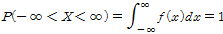  

확률변수 X가 구간 [a, b]에 있을 확률은 f(x)의 [a, b] 사이의 면적이 된다.  
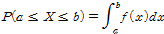  

### 3.4 기댓값과 분산
❖ 확률변수의 기댓값  
이산형:   
연속형:   
확률변수의 기댓값 E(X)를 모평균(population mean)이라고도 하며, 기호 μ 또는 μx 등으로 표기한다.

❖ 함수 g(X)의 기댓값  
이산형:   
연속형: 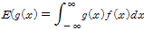  

❖ 확률변수 X의 분산  
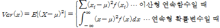  
 
Var(x) 계산에 대한 간편식
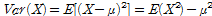  
 
❖ 표준화된 확률변수
평균이 μ, 표준편차가 σ인 확률변수 X가 있을 때, 변환
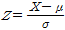  
를 표준화된 확률변수라 한다. Z는 평균이 0, 분산이 1인 확률변수이다.